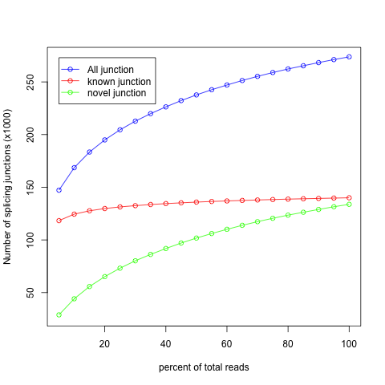
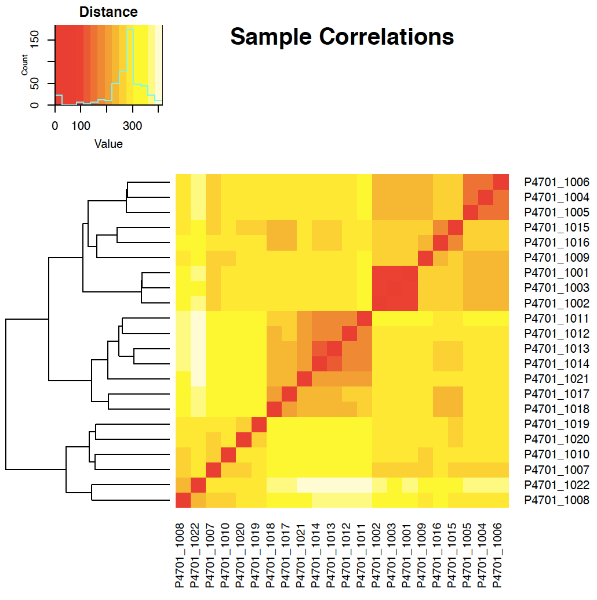

#Manual RNA BP 2.0
This is an an attempt at descripting the different programs and analyses that consitutes the NGI RNA BP 2.0 analysis pipeline. 

##Pipeline overview:
* FastQC - read quility control
* Cutadapt - trimming
* STAR - align
* RSeQC
   - bam stat
   - infer experiment
   - junction saturation
   - RPKM saturation
   - read duplication
   - inner distance
   - gene body coverage
   - read distribution
   - junction annotation
* dupRadar
* preseq - subread featureCounts - gene counts, biotype counts, rRNA estimation.
* String Tie - FPKMs for genes and transcripts
* edgeR - create MDS plot and sample pairwise distance heatmap / dendrogram
* MultiQC

## FastQC
FastQC gives general quality metrics about your reads. It provides information about the quality score distribution across your reads, the per base sequence content (%T/A/G/C). You get inormarmation wheter there is adapter contamination in your reads, or if there are other overrepresented sequences present.

For further reading and documentation see the [FastQC website](http://www.bioinformatics.babraham.ac.uk/projects/fastqc/) or the 
[FastQC Manual](https://biof-edu.colorado.edu/videos/dowell-short-read-class/day-4/fastqc-manual)

## Cutadapt
The NGI RNA BP 2.0 pipeline uses TrimGalore for removal of adapter contamination and trimming of low quality regions. TrimGalore is a wrapper for FastQC and Cutadapt. Where FastQC is used for indetifying  adapter contamination and regions with too low quality. Cutadapt is the used to remove these regions of the reads. 
[TrimGalore Website](http://www.bioinformatics.babraham.ac.uk/projects/trim_galore/)

[Cutadapt Documentation](http://cutadapt.readthedocs.io/en/stable/guide.html)
## STAR
STAR is a read aligner designed for RNA sequencing.  STAR stands for Spliced Transcripts Alignment to a Reference, and it is designed with speed in mind. 

##RSeQC
RSeQC is a package of scripts designed to evaluate the quality of RNA seq data. [RSeQC manual](http://rseqc.sourceforge.net/)

###bam_stat.py

Determines the amount of uniquely mapped reads based on the mapping quality. An example output:

```
bam_stat.py  -i Pairend_nonStrandSpecific_36mer_Human_hg19.bam

#Output (all numbers are read count)
#==================================================
Total records:                                 41465027
QC failed:                                     0
Optical/PCR duplicate:                         0
Non Primary Hits                               8720455
Unmapped reads:                                0

mapq < mapq_cut (non-unique):                  3127757
mapq >= mapq_cut (unique):                     29616815
Read-1:                                        14841738
Read-2:                                        14775077
Reads map to '+':                              14805391
Reads map to '-':                              14811424
Non-splice reads:                              25455360
Splice reads:                                  4161455
Reads mapped in proper pairs:                  21856264
Proper-paired reads map to different chrom:    7648
```
###infer_experiment.py

This scripts guesses how the reads were stranded for strand specific RNA-seq data. Example output:

```
infer_experiment.py -r hg19.refseq.bed12 -i Pairend_nonStrandSpecific_36mer_Human_hg19.bam

#Output:

This is PairEnd Data
Fraction of reads failed to determine: 0.0172
Fraction of reads explained by "1++,1--,2+-,2-+": 0.4903
Fraction of reads explained by "1+-,1-+,2++,2--": 0.4925
```

###junction_saturation.py
This scripts aims to determine if the used sequencing depth is enough to perform  alternative splicing analysis on the data. 



In the above example output the red line (known junction) has reached a plateau. Nearly all known junctions in this data set have already been detected, and deeper sequencing will thus not help in detecting more known junctions. The green line (novel junction) has not plateaued and thus further sequencing will likely aid in junction saturation.
In summary, if the lines are flattening out then you have sequenced deeply enough. 
###RPKM saturation
Resamples a subset of the total RNA reads and calculates the RPKM value for each subset. We use the default subsets of every 5% of the total reads. I.e 5%,10%...95%,100%. 
A percent relative error is then calcuated based on the subsamples, this is the y-axis in the graph. 


###read duplication


###inner distance

###gene body coverage

###read distribution

###junction annotation

##dupRadar
dupRadar is A Bioconductor library for R. 
It plots the duplication rate per gene. A good sample (i.e. without PCR duplication?) will have a sigmodial shape as seen in the example output below:  

##preseq 

subread featureCounts - gene counts, biotype counts, rRNA estimation.
##String Tie
FPKMs for genes and transcripts
## edgeR
edgR is a bioconductor package for R and is used to do differntial extression analysis on RNAseq data.
Rcreate MDS plot and sample pairwise distance heatmap / dendrogram
[edgeR Bioconductor page](https://bioconductor.org/packages/release/bioc/html/edgeR.html)
The output generated from edgeR process is a heatmap and a MDS-plot.
The heatmap may look something like this:


##MultiQC
[MultiQC](http://multiqc.info/) is a visualation tool and is what we at NGI use to generate our hmtl reports. It collects all the reports for your samples and genearate clear and simple reports for all your samples for an easy overview of your project. All the results of the RNA seq BP pipeline 2.0 is available in the `multiqc_report.html` file.  

