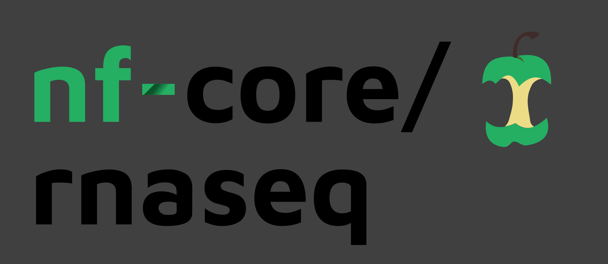

# 

**Nextflow RNA-Seq analysis pipeline, part of the nf-core community.**.

[](https://github.com/nf-core/rnaseq/actions)
[](https://github.com/nf-core/rnaseq/actions)
[](https://www.nextflow.io/)
[](https://zenodo.org/badge/latestdoi/127293091)

[](http://bioconda.github.io/)
[](https://hub.docker.com/r/nfcore/rnaseq/)
[](https://nfcore.slack.com/channels/rnaseq)

## Introduction

**nf-core/rnaseq** is a bioinformatics analysis pipeline used for RNA sequencing data.

The workflow processes raw data from
FastQ inputs ([FastQC](https://www.bioinformatics.babraham.ac.uk/projects/fastqc/),
[Trim Galore!](https://www.bioinformatics.babraham.ac.uk/projects/trim_galore/)),
aligns the reads
([STAR](https://github.com/alexdobin/STAR) or
[HiSAT2](https://ccb.jhu.edu/software/hisat2/index.shtml)),
generates counts relative to genes
([featureCounts](http://bioinf.wehi.edu.au/featureCounts/),
[StringTie](https://ccb.jhu.edu/software/stringtie/)) or transcripts
([Salmon](https://combine-lab.github.io/salmon/),
[tximport](https://bioconductor.org/packages/release/bioc/html/tximport.html) or
[RSEM](https://github.com/deweylab/RSEM)) and performs extensive quality-control on the results
([RSeQC](http://rseqc.sourceforge.net/),
[Qualimap](http://qualimap.bioinfo.cipf.es/),
[dupRadar](https://bioconductor.org/packages/release/bioc/html/dupRadar.html),
[Preseq](http://smithlabresearch.org/software/preseq/),
[edgeR](https://bioconductor.org/packages/release/bioc/html/edgeR.html),
[MultiQC](http://multiqc.info/)). See the [output documentation](docs/output.md) for more details of the results.

The pipeline is built using [Nextflow](https://www.nextflow.io), a workflow tool to run tasks across multiple compute infrastructures in a very portable manner. It comes with docker containers making installation trivial and results highly reproducible.

## Quick Start

i. Install [`nextflow`](https://nf-co.re/usage/installation)

ii. Install either [`Docker`](https://docs.docker.com/engine/installation/) or [`Singularity`](https://www.sylabs.io/guides/3.0/user-guide/) for full pipeline reproducibility (please only use [`Conda`](https://conda.io/miniconda.html) as a last resort; see [docs](https://nf-co.re/usage/configuration#basic-configuration-profiles))

iii. Download the pipeline and test it on a minimal dataset with a single command

```bash
nextflow run nf-core/rnaseq -profile test,<docker/singularity/conda>
```

iv. Start running your own analysis!

```bash
nextflow run nf-core/rnaseq -profile <docker/singularity/conda> --reads '*_R{1,2}.fastq.gz' --genome GRCh37
```

See [usage docs](docs/usage.md) for all of the available options when running the pipeline.

### Documentation

The nf-core/rnaseq pipeline comes with documentation about the pipeline, found in the `docs/` directory:

1. [Installation](https://nf-co.re/usage/installation)
2. Pipeline configuration
   - [Local installation](https://nf-co.re/usage/local_installation)
   - [Adding your own system config](https://nf-co.re/usage/adding_own_config)
   - [Reference genomes](https://nf-co.re/usage/reference_genomes)
3. [Running the pipeline](docs/usage.md)
4. [Output and how to interpret the results](docs/output.md)
5. [Troubleshooting](https://nf-co.re/usage/troubleshooting)

### Credits

These scripts were originally written for use at the [National Genomics Infrastructure](https://ngisweden.scilifelab.se), part of [SciLifeLab](http://www.scilifelab.se/) in Stockholm, Sweden, by Phil Ewels ([@ewels](https://github.com/ewels)) and Rickard Hammarén ([@Hammarn](https://github.com/Hammarn)).

Many thanks to other who have helped out along the way too, including (but not limited to):
[@Galithil](https://github.com/Galithil),
[@pditommaso](https://github.com/pditommaso),
[@orzechoj](https://github.com/orzechoj),
[@apeltzer](https://github.com/apeltzer),
[@colindaven](https://github.com/colindaven),
[@lpantano](https://github.com/lpantano),
[@olgabot](https://github.com/olgabot),
[@jburos](https://github.com/jburos),
[@drpatelh](https://github.com/drpatelh).

## Contributions and Support

If you would like to contribute to this pipeline, please see the [contributing guidelines](.github/CONTRIBUTING.md).

For further information or help, don't hesitate to get in touch on [Slack](https://nfcore.slack.com/channels/rnaseq) (you can join with [this invite](https://nf-co.re/join/slack)).

## Citation

<!-- TODO nf-core: Add citation for pipeline after first release. Uncomment lines below and update Zenodo doi. -->
<!-- If you use  nf-core/rnaseq for your analysis, please cite it using the following doi: [10.5281/zenodo.XXXXXX](https://doi.org/10.5281/zenodo.XXXXXX) -->

You can cite the `nf-core` publication as follows:

> **The nf-core framework for community-curated bioinformatics pipelines.**
>
> Philip Ewels, Alexander Peltzer, Sven Fillinger, Harshil Patel, Johannes Alneberg, Andreas Wilm, Maxime Ulysse Garcia, Paolo Di Tommaso & Sven Nahnsen.
>
> _Nat Biotechnol._ 2020 Feb 13. doi: [10.1038/s41587-020-0439-x](https://dx.doi.org/10.1038/s41587-020-0439-x).  
> ReadCube: [Full Access Link](https://rdcu.be/b1GjZ)
