# nf-core/rnaseq: Output

## Introduction

This document describes the output produced by the pipeline. Most of the plots are taken from the MultiQC report generated from the [full-sized test dataset](https://github.com/nf-core/test-datasets/tree/rnaseq#full-test-dataset-origin) for the pipeline using a command similar to the one below:

```bash
nextflow run nf-core/rnaseq -profile test_full,<docker/singularity/institute>
```

The directories listed below will be created in the results directory after the pipeline has finished. All paths are relative to the top-level results directory.

## Pipeline overview

The pipeline is built using [Nextflow](https://www.nextflow.io/) and processes data using the following steps:

- [Preprocessing](#preprocessing)
  - [cat](#cat) - Merge re-sequenced FastQ files
  - [FastQC](#fastqc) - Raw read QC
  - [UMI-tools extract](#umi-tools-extract) - UMI barcode extraction
  - [TrimGalore](#trimgalore) - Adapter and quality trimming
  - [fastp](#fastp) - Adapter and quality trimming
  - [BBSplit](#bbsplit) - Removal of genome contaminants
  - [SortMeRNA](#sortmerna) - Removal of ribosomal RNA
- [Alignment and quantification](#alignment-and-quantification)
  - [STAR and Salmon](#star-and-salmon) - Fast spliced aware genome alignment and transcriptome quantification
  - [STAR via RSEM](#star-via-rsem) - Alignment and quantification of expression levels
  - [HISAT2](#hisat2) - Memory efficient splice aware alignment to a reference
- [Alignment post-processing](#alignment-post-processing)
  - [SAMtools](#samtools) - Sort and index alignments
  - [UMI-tools dedup](#umi-tools-dedup) - UMI-based deduplication
  - [picard MarkDuplicates](#picard-markduplicates) - Duplicate read marking
- [Other steps](#other-steps)
  - [StringTie](#stringtie) - Transcript assembly and quantification
  - [BEDTools and bedGraphToBigWig](#bedtools-and-bedgraphtobigwig) - Create bigWig coverage files
- [Quality control](#quality-control)
  - [RSeQC](#rseqc) - Various RNA-seq QC metrics
  - [Qualimap](#qualimap) - Various RNA-seq QC metrics
  - [dupRadar](#dupradar) - Assessment of technical / biological read duplication
  - [Preseq](#preseq) - Estimation of library complexity
  - [featureCounts](#featurecounts) - Read counting relative to gene biotype
  - [DESeq2](#deseq2) - PCA plot and sample pairwise distance heatmap and dendrogram
  - [MultiQC](#multiqc) - Present QC for raw reads, alignment, read counting and sample similiarity
- [Pseudoalignment and quantification](#pseudoalignment-and-quantification)
  - [Salmon](#pseudoalignment) - Wicked fast gene and isoform quantification relative to the transcriptome
  - [Kallisto](#pseudoalignment) - Near-optimal probabilistic RNA-seq quantification
- [Workflow reporting and genomes](#workflow-reporting-and-genomes)
  - [Reference genome files](#reference-genome-files) - Saving reference genome indices/files
  - [Pipeline information](#pipeline-information) - Report metrics generated during the workflow execution

## Preprocessing

### cat

<details markdown="1">
<summary>Output files</summary>

- `fastq/`
  - `*.merged.fastq.gz`: If `--save_merged_fastq` is specified, concatenated FastQ files will be placed in this directory.

</details>

If multiple libraries/runs have been provided for the same sample in the input samplesheet (e.g. to increase sequencing depth) then these will be merged at the very beginning of the pipeline in order to have consistent sample naming throughout the pipeline. Please refer to the [usage documentation](https://nf-co.re/rnaseq/usage#samplesheet-input) to see how to specify these samples in the input samplesheet.

### FastQC

<details markdown="1">
<summary>Output files</summary>

- `fastqc/`
  - `*_fastqc.html`: FastQC report containing quality metrics.
  - `*_fastqc.zip`: Zip archive containing the FastQC report, tab-delimited data file and plot images.

> **NB:** The FastQC plots in this directory are generated relative to the raw, input reads. They may contain adapter sequence and regions of low quality. To see how your reads look after adapter and quality trimming please refer to the FastQC reports in the `trimgalore/fastqc/` directory.

</details>

[FastQC](http://www.bioinformatics.babraham.ac.uk/projects/fastqc/) gives general quality metrics about your sequenced reads. It provides information about the quality score distribution across your reads, per base sequence content (%A/T/G/C), adapter contamination and overrepresented sequences. For further reading and documentation see the [FastQC help pages](http://www.bioinformatics.babraham.ac.uk/projects/fastqc/Help/).

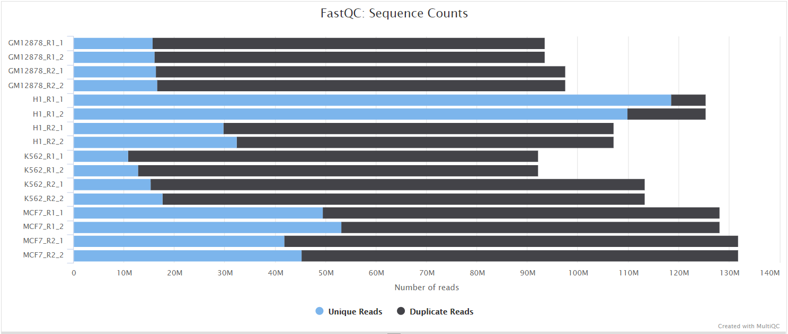

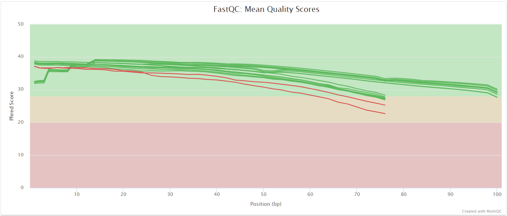

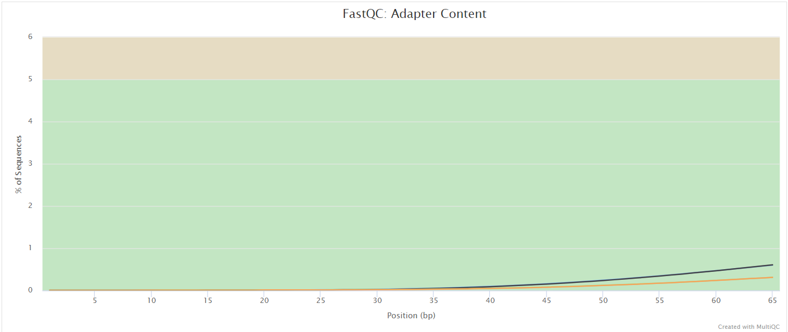

### UMI-tools extract

<details markdown="1">
<summary>Output files</summary>

- `umitools/`
  - `*.fastq.gz`: If `--save_umi_intermeds` is specified, FastQ files **after** UMI extraction will be placed in this directory.
  - `*.log`: Log file generated by the UMI-tools `extract` command.

</details>

[UMI-tools](https://github.com/CGATOxford/UMI-tools) deduplicates reads based on unique molecular identifiers (UMIs) to address PCR-bias. Firstly, the UMI-tools `extract` command removes the UMI barcode information from the read sequence and adds it to the read name. Secondly, reads are deduplicated based on UMI identifier after mapping as highlighted in the [UMI-tools dedup](#umi-tools-dedup) section.

To facilitate processing of input data which has the UMI barcode already embedded in the read name from the start, `--skip_umi_extract` can be specified in conjunction with `--with_umi`.

### TrimGalore

<details markdown="1">
<summary>Output files</summary>

- `trimgalore/`
  - `*.fq.gz`: If `--save_trimmed` is specified, FastQ files **after** adapter trimming will be placed in this directory.
  - `*_trimming_report.txt`: Log file generated by Trim Galore!.
- `trimgalore/fastqc/`
  - `*_fastqc.html`: FastQC report containing quality metrics for read 1 (_and read2 if paired-end_) **after** adapter trimming.
  - `*_fastqc.zip`: Zip archive containing the FastQC report, tab-delimited data file and plot images.

</details>

[Trim Galore!](https://www.bioinformatics.babraham.ac.uk/projects/trim_galore/) is a wrapper tool around Cutadapt and FastQC to peform quality and adapter trimming on FastQ files. Trim Galore! will automatically detect and trim the appropriate adapter sequence. It is the default trimming tool used by this pipeline, however you can use fastp instead by specifying the `--trimmer fastp` parameter. You can specify additional options for Trim Galore! via the `--extra_trimgalore_args` parameters.

> **NB:** TrimGalore! will only run using multiple cores if you are able to use more than > 5 and > 6 CPUs for single- and paired-end data, respectively. The total cores available to TrimGalore! will also be capped at 4 (7 and 8 CPUs in total for single- and paired-end data, respectively) because there is no longer a run-time benefit. See [release notes](https://github.com/FelixKrueger/TrimGalore/blob/master/Changelog.md#version-060-release-on-1-mar-2019) and [discussion whilst adding this logic to the nf-core/atacseq pipeline](https://github.com/nf-core/atacseq/pull/65).

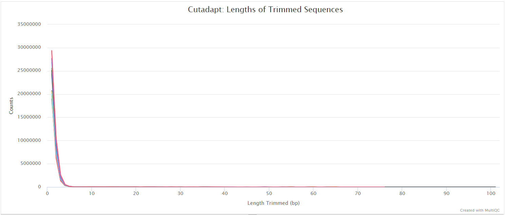

### fastp

<details markdown="1">
<summary>Output files</summary>

- `fastp/`
  - `*.fastq.gz`: If `--save_trimmed` is specified, FastQ files **after** adapter trimming will be placed in this directory.
  - `*.fastp.html`: Trimming report in html format.
  - `*.fastp.json`: Trimming report in json format.
- `fastp/log/`
  - `*.fastp.log`: Trimming log file.
- `fastp/fastqc/`
  - `*_fastqc.html`: FastQC report containing quality metrics for read 1 (_and read2 if paired-end_) **after** adapter trimming.
  - `*_fastqc.zip`: Zip archive containing the FastQC report, tab-delimited data file and plot images.

</details>

[fastp](https://github.com/OpenGene/fastp) is a tool designed to provide fast, all-in-one preprocessing for FastQ files. It has been developed in C++ with multithreading support to achieve higher performance. fastp can be used in this pipeline for standard adapter trimming and quality filtering by setting the `--trimmer fastp` parameter. You can specify additional options for fastp via the `--extra_fastp_args` parameter.

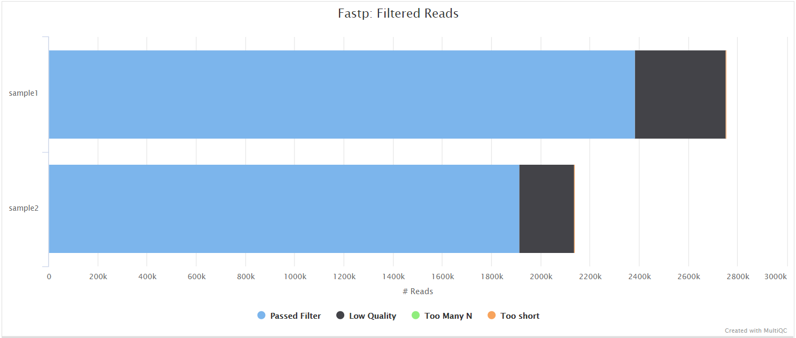

### BBSplit

<details markdown="1">
<summary>Output files</summary>

- `bbsplit/`
  - `*.fastq.gz`: If `--save_bbsplit_reads` is specified FastQ files split by reference will be saved to the results directory. Reads from the main reference genome will be named "_primary_.fastq.gz". Reads from contaminating genomes will be named "_<SHORT_NAME>_.fastq.gz" where `<SHORT_NAME>` is the first column in `--bbsplit_fasta_list` that needs to be provided to initially build the index.
  - `*.txt`: File containing statistics on how many reads were assigned to each reference.

</details>

[BBSplit](http://seqanswers.com/forums/showthread.php?t=41288) is a tool that bins reads by mapping to multiple references simultaneously, using BBMap. The reads go to the bin of the reference they map to best. There are also disambiguation options, such that reads that map to multiple references can be binned with all of them, none of them, one of them, or put in a special "ambiguous" file for each of them.

This functionality would be especially useful, for example, if you have [mouse PDX](https://en.wikipedia.org/wiki/Patient_derived_xenograft) samples that contain a mixture of human and mouse genomic DNA/RNA and you would like to filter out any mouse derived reads.

The BBSplit index will have to be built at least once with this pipeline by providing [`--bbsplit_fasta_list`](https://nf-co.re/rnaseq/parameters#bbsplit_fasta_list) which has to be a file containing 2 columns: short name and full path to reference genome(s):

```bash
mm10,/path/to/mm10.fa
ecoli,/path/to/ecoli.fa
sarscov2,/path/to/sarscov2.fa
```

You can save the index by using the [`--save_reference`](https://nf-co.re/rnaseq/parameters#save_reference) parameter and then provide it via [`--bbsplit_index`](https://nf-co.re/rnaseq/parameters#bbsplit_index) for future runs. As described in the `Output files` dropdown box above the FastQ files relative to the main reference genome will always be called `*primary*.fastq.gz`.

### SortMeRNA

<details markdown="1">
<summary>Output files</summary>

- `sortmerna/`
  - `*.fastq.gz`: If `--save_non_ribo_reads` is specified, FastQ files containing non-rRNA reads will be placed in this directory.
  - `*.log`: Log file generated by SortMeRNA with information regarding reads that matched the reference database(s).

</details>

When `--remove_ribo_rna` is specified, the pipeline uses [SortMeRNA](https://github.com/biocore/sortmerna) for the removal of ribosomal RNA. By default, [rRNA databases](https://github.com/biocore/sortmerna/tree/master/data/rRNA_databases) defined in the SortMeRNA GitHub repo are used. You can see an example in the pipeline Github repository in `assets/rrna-default-dbs.txt` which is used by default via the `--ribo_database_manifest` parameter. Please note that commercial/non-academic entities require [`licensing for SILVA`](https://www.arb-silva.de/silva-license-information) for these default databases.


## Alignment and quantification

### STAR, Salmon and Kallisto

<details markdown="1">
<summary>Output files</summary>

- `star_salmon/`
  - `*.Aligned.out.bam`: If `--save_align_intermeds` is specified the original BAM file containing read alignments to the reference genome will be placed in this directory.
  - `*.Aligned.toTranscriptome.out.bam`: If `--save_align_intermeds` is specified the original BAM file containing read alignments to the transcriptome will be placed in this directory.
- `star_salmon/log/`
  - `*.SJ.out.tab`: File containing filtered splice junctions detected after mapping the reads.
  - `*.Log.final.out`: STAR alignment report containing the mapping results summary.
  - `*.Log.out` and `*.Log.progress.out`: STAR log files containing detailed information about the run. Typically only useful for debugging purposes.
- `star_salmon/unmapped/`
  - `*.fastq.gz`: If `--save_unaligned` is specified, FastQ files containing unmapped reads will be placed in this directory.

</details>

[STAR](https://github.com/alexdobin/STAR) is a read aligner designed for splice aware mapping typical of RNA sequencing data. STAR stands for *S*pliced *T*ranscripts *A*lignment to a *R*eference, and has been shown to have high accuracy and outperforms other aligners by more than a factor of 50 in mapping speed, but it is memory intensive. Using `--aligner star_salmon` is the default alignment and quantification option.

The STAR section of the MultiQC report shows a bar plot with alignment rates: good samples should have most reads as _Uniquely mapped_ and few _Unmapped_ reads.


[Salmon](https://salmon.readthedocs.io/en/latest/salmon.html) from [Ocean Genomics](https://oceangenomics.com/) and [Kallisto](https://pachterlab.github.io/kallisto/), from the Pachter Lab, are provided as options for pseudoalignment. Both allow quantification of reads against an index generated from a reference set of target transcripts. By default, the transcriptome-level BAM files generated by STAR are provided to Salmon for downstream quantification, and Kallisto is not an option here (it does not allow BAM file input). But you can provide FASTQ files directly as input to either Salmon or Kallisto in order to pseudoalign and quantify your data by providing the `--pseudo_aligner salmon` or `--pseudo_aligner kallisto` parameter. See the [Salmon](#pseudoalignment) and [Kallisto](#pseudoalignment) results sections for more details.

### STAR via RSEM

<details markdown="1">
<summary>Output files</summary>

- `star_rsem/`
  - `rsem.merged.gene_counts.tsv`: Matrix of gene-level raw counts across all samples.
  - `rsem.merged.gene_tpm.tsv`: Matrix of gene-level TPM values across all samples.
  - `rsem.merged.transcript_counts.tsv`: Matrix of isoform-level raw counts across all samples.
  - `rsem.merged.transcript_tpm.tsv`: Matrix of isoform-level TPM values across all samples.
  - `*.genes.results`: RSEM gene-level quantification results for each sample.
  - `*.isoforms.results`: RSEM isoform-level quantification results for each sample.
  - `*.STAR.genome.bam`: If `--save_align_intermeds` is specified the original BAM file containing read alignments to the reference genome will be placed in this directory.
  - `*.transcript.bam`: If `--save_align_intermeds` is specified the original BAM file containing read alignments to the transcriptome will be placed in this directory.
- `star_rsem/<SAMPLE>.stat/`
  - `*.cnt`, `*.model`, `*.theta`: RSEM counts and statistics for each sample.
  - `star_rsem/log/`
  - `*.log`: STAR alignment report containing the mapping results summary.

</details>

[RSEM](https://github.com/deweylab/RSEM) is a software package for estimating gene and isoform expression levels from RNA-seq data. It has been widely touted as one of the most accurate quantification tools for RNA-seq analysis. RSEM wraps other popular tools to map the reads to the genome (i.e. STAR, Bowtie2, HISAT2; STAR is used in this pipeline) which are then subsequently filtered relative to a transcriptome before quantifying at the gene- and isoform-level. Other advantages of using RSEM are that it performs both the alignment and quantification in a single package and its ability to effectively use ambiguously-mapping reads.

You can choose to align and quantify your data with RSEM by providing the `--aligner star_rsem` parameter.

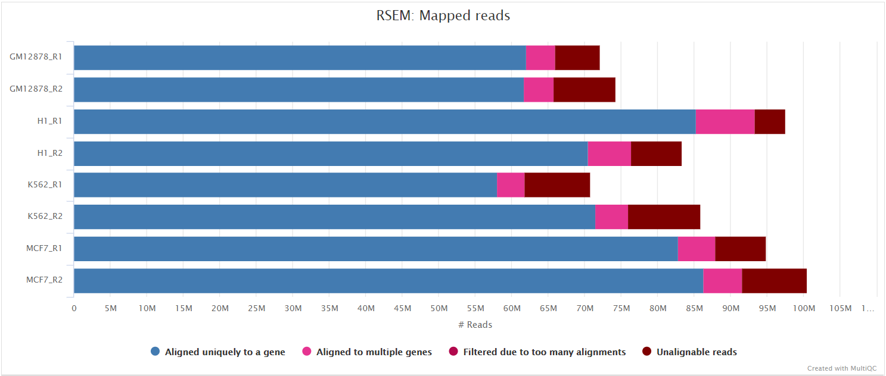

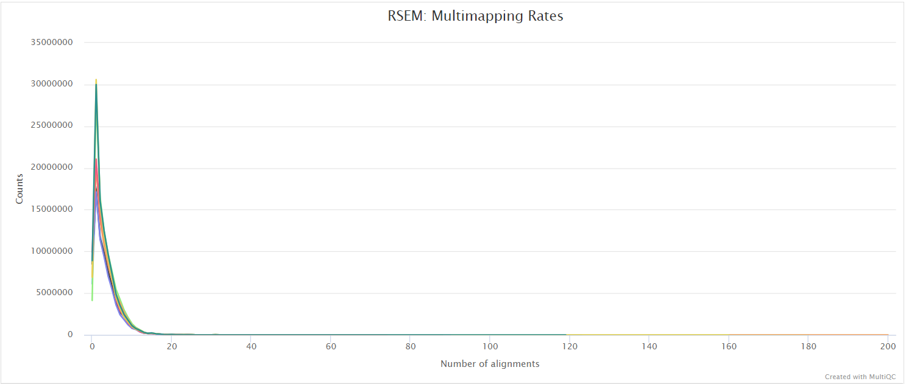

### HISAT2

<details markdown="1">
<summary>Output files</summary>

- `hisat2/`
  - `<SAMPLE>.bam`: If `--save_align_intermeds` is specified the original BAM file containing read alignments to the reference genome will be placed in this directory.
- `hisat2/log/`
  - `*.log`: HISAT2 alignment report containing the mapping results summary.
- `hisat2/unmapped/`
  - `*.fastq.gz`: If `--save_unaligned` is specified, FastQ files containing unmapped reads will be placed in this directory.

</details>

[HISAT2](http://daehwankimlab.github.io/hisat2/) is a fast and sensitive alignment program for mapping next-generation sequencing reads (both DNA and RNA) to a population of human genomes as well as to a single reference genome. It introduced a new indexing scheme called a Hierarchical Graph FM index (HGFM) which when combined with several alignment strategies, enable rapid and accurate alignment of sequencing reads. The HISAT2 route through the pipeline is a good option if you have memory limitations on your compute. However, quantification isn't performed if using `--aligner hisat2` due to the lack of an appropriate option to calculate accurate expression estimates from HISAT2 derived genomic alignments. However, you can use this route if you have a preference for the alignment, QC and other types of downstream analysis compatible with the output of HISAT2.

You can choose to align your data with HISAT2 by providing the `--aligner hisat2` parameter.

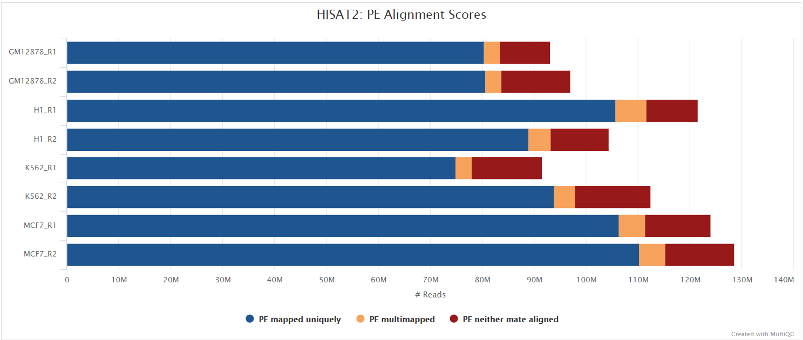

## Alignment post-processing

The pipeline has been written in a way where all the files generated downstream of the alignment are placed in the same directory as specified by `--aligner` e.g. if `--aligner star_salmon` is specified then all the downstream results will be placed in the `star_salmon/` directory. This helps with organising the directory structure and more importantly, allows the end-user to get the results from multiple aligners by simply re-running the pipeline with a different `--aligner` option along the `-resume` parameter. It also means that results won't be overwritten when resuming the pipeline and can be used for benchmarking between alignment algorithms if required.

### SAMtools

<details markdown="1">
<summary>Output files</summary>

- `<ALIGNER>/`
  - `<SAMPLE>.sorted.bam`: If `--save_align_intermeds` is specified the original coordinate sorted BAM file containing read alignments will be placed in this directory.
  - `<SAMPLE>.sorted.bam.bai`: If `--save_align_intermeds` is specified the BAI index file for the original coordinate sorted BAM file will be placed in this directory.
  - `<SAMPLE>.sorted.bam.csi`: If `--save_align_intermeds --bam_csi_index` is specified the CSI index file for the original coordinate sorted BAM file will be placed in this directory.
- `<ALIGNER>/samtools_stats/`
  - SAMtools `<SAMPLE>.sorted.bam.flagstat`, `<SAMPLE>.sorted.bam.idxstats` and `<SAMPLE>.sorted.bam.stats` files generated from the alignment files.

</details>

The original BAM files generated by the selected alignment algorithm are further processed with [SAMtools](http://samtools.sourceforge.net/) to sort them by coordinate, for indexing, as well as to generate read mapping statistics.

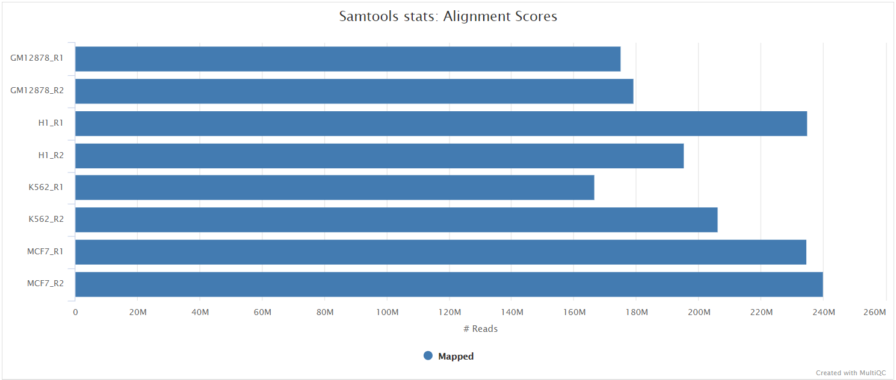

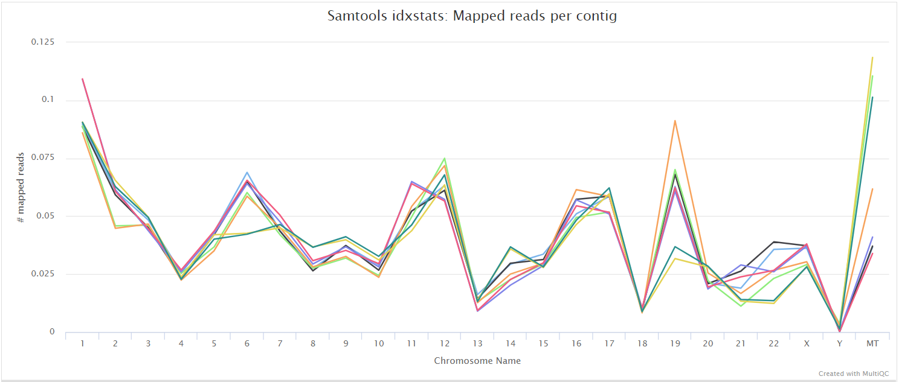

### UMI-tools dedup

<details markdown="1">
<summary>Output files</summary>

- `<ALIGNER>/`
  - `<SAMPLE>.umi_dedup.sorted.bam`: If `--save_umi_intermeds` is specified the UMI deduplicated, coordinate sorted BAM file containing read alignments will be placed in this directory.
  - `<SAMPLE>.umi_dedup.sorted.bam.bai`: If `--save_umi_intermeds` is specified the BAI index file for the UMI deduplicated, coordinate sorted BAM file will be placed in this directory.
  - `<SAMPLE>.umi_dedup.sorted.bam.csi`: If `--save_umi_intermeds --bam_csi_index` is specified the CSI index file for the UMI deduplicated, coordinate sorted BAM file will be placed in this directory.
- `<ALIGNER>/umitools/`
  - `*_edit_distance.tsv`: Reports the (binned) average edit distance between the UMIs at each position.
  - `*_per_umi.tsv`: UMI-level summary statistics.
  - `*_per_umi_per_position.tsv`: Tabulates the counts for unique combinations of UMI and position.

The content of the files above is explained in more detail in the [UMI-tools documentation](https://umi-tools.readthedocs.io/en/latest/reference/dedup.html#dedup-specific-options).

</details>

After extracting the UMI information from the read sequence (see [UMI-tools extract](#umi-tools-extract)), the second step in the removal of UMI barcodes involves deduplicating the reads based on both mapping and UMI barcode information using the UMI-tools `dedup` command. This will generate a filtered BAM file after the removal of PCR duplicates.

### picard MarkDuplicates

<details markdown="1">
<summary>Output files</summary>

- `<ALIGNER>/`
  - `<SAMPLE>.markdup.sorted.bam`: Coordinate sorted BAM file after duplicate marking. This is the final post-processed BAM file and so will be saved by default in the results directory.
  - `<SAMPLE>.markdup.sorted.bam.bai`: BAI index file for coordinate sorted BAM file after duplicate marking. This is the final post-processed BAM index file and so will be saved by default in the results directory.
  - `<SAMPLE>.markdup.sorted.bam.csi`: CSI index file for coordinate sorted BAM file after duplicate marking. This is the final post-processed BAM index file and so will be saved by default in the results directory. Only generated if `--bam_csi_index` is specified as a parameter.
- `<ALIGNER>/samtools_stats/`
  - SAMtools `<SAMPLE>.markdup.sorted.bam.flagstat`, `<SAMPLE>.markdup.sorted.bam.idxstats` and `<SAMPLE>.markdup.sorted.bam.stats` files generated from the duplicate marked alignment files.
- `<ALIGNER>/picard_metrics/`
  - `<SAMPLE>.markdup.sorted.MarkDuplicates.metrics.txt`: Metrics file from MarkDuplicates.

</details>

Unless you are using [UMIs](https://emea.illumina.com/science/sequencing-method-explorer/kits-and-arrays/umi.html) it is not possible to establish whether the fragments you have sequenced from your sample were derived via true biological duplication (i.e. sequencing independent template fragments) or as a result of PCR biases introduced during the library preparation. By default, the pipeline uses [picard MarkDuplicates](https://broadinstitute.github.io/picard/command-line-overview.html#MarkDuplicates) to _mark_ the duplicate reads identified amongst the alignments to allow you to guage the overall level of duplication in your samples. However, for RNA-seq data it is not recommended to physically remove duplicate reads from the alignments (unless you are using UMIs) because you expect a significant level of true biological duplication that arises from the same fragments being sequenced from for example highly expressed genes. This step will be skipped automatically when using the `--with_umi` option or explicitly via the `--skip_markduplicates` parameter.


## Other steps

### StringTie

<details markdown="1">
<summary>Output files</summary>

- `<ALIGNER>/stringtie/`
  - `*.coverage.gtf`: GTF file containing transcripts that are fully covered by reads.
  - `*.transcripts.gtf`: GTF file containing all of the assembled transcipts from StringTie.
  - `*.gene_abundance.txt`: Text file containing gene aboundances and FPKM values.
- `<ALIGNER>/stringtie/<SAMPLE>.ballgown/`: Ballgown output directory.

</details>

[StringTie](https://ccb.jhu.edu/software/stringtie/) is a fast and highly efficient assembler of RNA-Seq alignments into potential transcripts. It uses a novel network flow algorithm as well as an optional de novo assembly step to assemble and quantitate full-length transcripts representing multiple splice variants for each gene locus. In order to identify differentially expressed genes between experiments, StringTie's output can be processed by specialized software like [Ballgown](https://github.com/alyssafrazee/ballgown), [Cuffdiff](http://cole-trapnell-lab.github.io/cufflinks/cuffdiff/index.html) or other programs ([DESeq2](https://bioconductor.org/packages/release/bioc/html/DESeq2.html), [edgeR](https://bioconductor.org/packages/release/bioc/html/edgeR.html), etc.).

### BEDTools and bedGraphToBigWig

<details markdown="1">
<summary>Output files</summary>

- `<ALIGNER>/bigwig/`
  - `*.forward.bigWig`: bigWig coverage file relative to genes on the forward DNA strand.
  - `*.reverse.bigWig`: bigWig coverage file relative to genes on the reverse DNA strand.

</details>

The [bigWig](https://genome.ucsc.edu/goldenpath/help/bigWig.html) format is an indexed binary format useful for displaying dense, continuous data in Genome Browsers such as the [UCSC](https://genome.ucsc.edu/cgi-bin/hgTracks) and [IGV](http://software.broadinstitute.org/software/igv/). This mitigates the need to load the much larger BAM files for data visualisation purposes which will be slower and result in memory issues. The bigWig format is also supported by various bioinformatics software for downstream processing such as meta-profile plotting.

## Quality control

### RSeQC

[RSeQC](<(http://rseqc.sourceforge.net/)>) is a package of scripts designed to evaluate the quality of RNA-seq data. This pipeline runs several, but not all RSeQC scripts. You can tweak the supported scripts you would like to run by adjusting the `--rseqc_modules` parameter which by default will run all of the following: `bam_stat.py`, `inner_distance.py`, `infer_experiment.py`, `junction_annotation.py`, `junction_saturation.py`,`read_distribution.py` and `read_duplication.py`.

The majority of RSeQC scripts generate output files which can be plotted and summarised in the MultiQC report.

#### Infer experiment

<details markdown="1">
<summary>Output files</summary>

- `<ALIGNER>/rseqc/infer_experiment/`
  - `*.infer_experiment.txt`: File containing fraction of reads mapping to given strandedness configurations.

</details>

This script predicts the "strandedness" of the protocol (i.e. unstranded, sense or antisense) that was used to prepare the sample for sequencing by assessing the orientation in which aligned reads overlay gene features in the reference genome. The strandedness of each sample has to be provided to the pipeline in the input samplesheet (see [usage docs](https://nf-co.re/rnaseq/usage#samplesheet-input)). However, this information is not always available, especially for public datasets. As a result, additional features have been incorporated into this pipeline to auto-detect whether you have provided the correct information in the samplesheet, and if this is not the case then the affected libraries will be flagged in the table under 'Strandedness Checks' elsewhere in the report. If required, this will allow you to correct the input samplesheet and rerun the pipeline with the accurate strand information. Note, it is important to get this information right because it can affect the final results.

RSeQC documentation: [infer_experiment.py](http://rseqc.sourceforge.net/#infer-experiment-py)


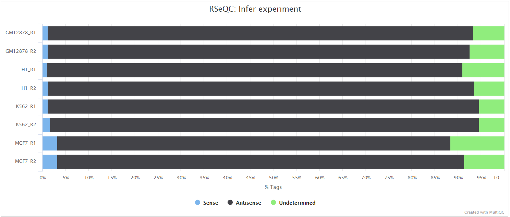

#### Read distribution

<details markdown="1">
<summary>Output files</summary>

- `<ALIGNER>/rseqc/read_distribution/`
  - `*.read_distribution.txt`: File containing fraction of reads mapping to genome feature e.g. CDS exon, 5’UTR exon, 3’ UTR exon, Intron, Intergenic regions etc.

</details>

This tool calculates how mapped reads are distributed over genomic features. A good result for a standard RNA-seq experiments is generally to have as many exonic reads as possible (`CDS_Exons`). A large amount of intronic reads could be indicative of DNA contamination in your sample but may be expected for a total RNA preparation.

RSeQC documentation: [read_distribution.py](http://rseqc.sourceforge.net/#read-distribution-py)

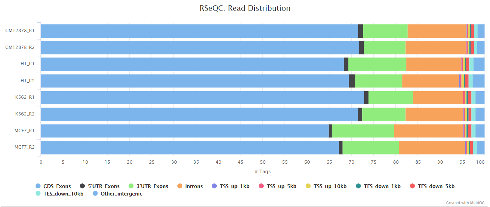

#### Junction annotation

<details markdown="1">
<summary>Output files</summary>

- `<ALIGNER>/rseqc/junction_annotation/bed/`
  - `*.junction.bed`: BED file containing splice junctions.
  - `*.junction.Interact.bed`: BED file containing interacting splice junctions.
- `<ALIGNER>/rseqc/junction_annotation/log/`
  - `*.junction_annotation.log`: Log file generated by the program.
- `<ALIGNER>/rseqc/junction_annotation/pdf/`
  - `*.splice_events.pdf`: PDF file containing splicing events plot.
  - `*.splice_junction.pdf`: PDF file containing splice junctions plot.
- `<ALIGNER>/rseqc/junction_annotation/rscript/`
  - `*.junction_plot.r`: R script used to generate pdf plots above.
- `<ALIGNER>/rseqc/junction_annotation/xls/`
  - `*.junction.xls`: Excel spreadsheet with junction information.

</details>

Junction annotation compares detected splice junctions to a reference gene model. Splicing annotation is performed in two levels: splice event level and splice junction level.

RSeQC documentation: [junction_annotation.py](http://rseqc.sourceforge.net/#junction-annotation-py)

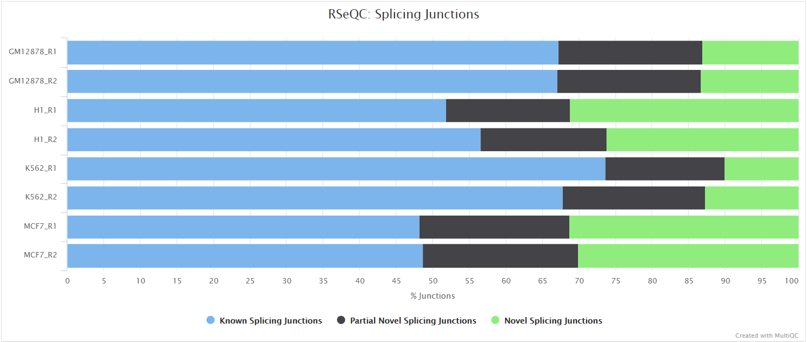

#### Inner distance

<details markdown="1">
<summary>Output files</summary>

- `<ALIGNER>/rseqc/inner_distance/pdf/`
  - `*.inner_distance_plot.pdf`: PDF file containing inner distance plot.
- `<ALIGNER>/rseqc/inner_distance/rscript/`
  - `*.inner_distance_plot.r`: R script used to generate pdf plot above.
- `<ALIGNER>/rseqc/inner_distance/txt/`
  - `*.inner_distance_freq.txt`: File containing frequency of insert sizes.
  - `*.inner_distance_mean.txt`: File containing mean, median and standard deviation of insert sizes.

</details>

The inner distance script tries to calculate the inner distance between two paired-end reads. It is the distance between the end of read 1 to the start of read 2, and it is sometimes confused with the insert size (see [this blog post](http://thegenomefactory.blogspot.com.au/2013/08/paired-end-read-confusion-library.html) for disambiguation):

This plot will not be generated for single-end data. Very short inner distances are often seen in old or degraded samples (_eg._ FFPE) and values can be negative if the reads overlap consistently.

RSeQC documentation: [inner_distance.py](http://rseqc.sourceforge.net/#inner-distance-py)

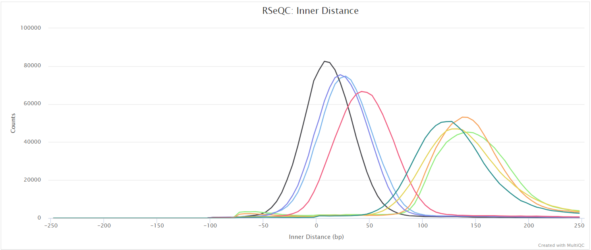

#### Junction saturation

<details markdown="1">
<summary>Output files</summary>

- `<ALIGNER>/rseqc/junction_saturation/pdf/`
  - `*.junctionSaturation_plot.pdf`: PDF file containing junction saturation plot.
- `<ALIGNER>/rseqc/junction_saturation/rscript/`
  - `*.junctionSaturation_plot.r`: R script used to generate pdf plot above.

</details>

This script shows the number of splice sites detected within the data at various levels of subsampling. A sample that reaches a plateau before getting to 100% data indicates that all junctions in the library have been detected, and that further sequencing will not yield any more observations. A good sample should approach such a plateau of _Known junctions_, however, very deep sequencing is typically required to saturate all _Novel Junctions_ in a sample.

RSeQC documentation: [junction_saturation.py](http://rseqc.sourceforge.net/#junction-saturation-py)


#### Read duplication

<details markdown="1">
<summary>Output files</summary>

- `<ALIGNER>/rseqc/read_duplication/pdf/`
  - `*.DupRate_plot.pdf`: PDF file containing read duplication plot.
- `<ALIGNER>/rseqc/read_duplication/rscript/`
  - `*.DupRate_plot.r`: R script used to generate pdf plot above.
- `<ALIGNER>/rseqc/read_duplication/xls/`
  - `*.pos.DupRate.xls`: Read duplication rate determined from mapping position of read. First column is “occurrence” or duplication times, second column is number of uniquely mapped reads.
  - `*.seq.DupRate.xls`: Read duplication rate determined from sequence of read. First column is “occurrence” or duplication times, second column is number of uniquely mapped reads.

</details>

This plot shows the number of reads (y-axis) with a given number of exact duplicates (x-axis). Most reads in an RNA-seq library should have a low number of exact duplicates. Samples which have many reads with many duplicates (a large area under the curve) may be suffering excessive technical duplication.

RSeQC documentation: [read_duplication.py](http://rseqc.sourceforge.net/#read-duplication-py)

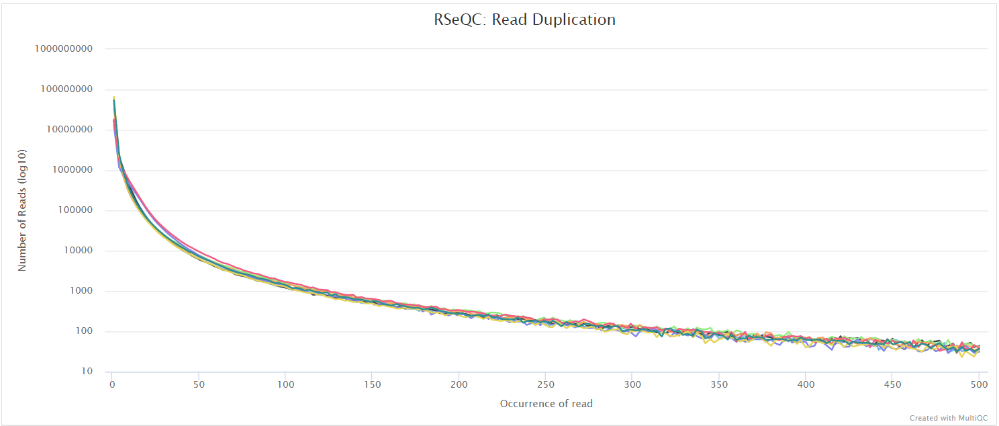

#### BAM stat

<details markdown="1">
<summary>Output files</summary>

- `<ALIGNER>/rseqc/bam_stat/`
  - `*.bam_stat.txt`: Mapping statistics for the BAM file.

</details>

This script gives numerous statistics about the aligned BAM files. A typical output looks as follows:

```txt
#Output (all numbers are read count)
#==================================================
Total records:                                 41465027
QC failed:                                     0
Optical/PCR duplicate:                         0
Non Primary Hits                               8720455
Unmapped reads:                                0

mapq < mapq_cut (non-unique):                  3127757
mapq >= mapq_cut (unique):                     29616815
Read-1:                                        14841738
Read-2:                                        14775077
Reads map to '+':                              14805391
Reads map to '-':                              14811424
Non-splice reads:                              25455360
Splice reads:                                  4161455
Reads mapped in proper pairs:                  21856264
Proper-paired reads map to different chrom:    7648
```

MultiQC plots each of these statistics in a dot plot. Each sample in the project is a dot - hover to see the sample highlighted across all fields.

RSeQC documentation: [bam_stat.py](http://rseqc.sourceforge.net/#bam-stat-py)

#### TIN

<details markdown="1">
<summary>Output files</summary>

- `<ALIGNER>/rseqc/tin/`
  - `*.summary.txt`: File containing TIN results summary.
  - `*.tin.xls`: XLS file containing TIN results.

</details>

This script is designed to evaluate RNA integrity at the transcript level. TIN (transcript integrity number) is named in analogous to RIN (RNA integrity number). RIN (RNA integrity number) is the most widely used metric to evaluate RNA integrity at sample (or transcriptome) level. It is a very useful preventive measure to ensure good RNA quality and robust, reproducible RNA sequencing. This process isn't run by default - please see [this issue](https://github.com/nf-core/rnaseq/issues/769).

RSeQC documentation: [tin.py](http://rseqc.sourceforge.net/#tin-py)

### Qualimap

<details markdown="1">
<summary>Output files</summary>

- `<ALIGNER>/qualimap/<SAMPLE>/`
  - `qualimapReport.html`: Qualimap HTML report that can be viewed in a web browser.
  - `rnaseq_qc_results.txt`: Textual results output.
- `<ALIGNER>/qualimap/<SAMPLE>/images_qualimapReport/`: Images required for the HTML report.
- `<ALIGNER>/qualimap/<SAMPLE>/raw_data_qualimapReport/`: Raw data required for the HTML report.
- `<ALIGNER>/qualimap/<SAMPLE>/css/`: CSS files required for the HTML report.

</details>

[Qualimap](http://qualimap.bioinfo.cipf.es/) is a platform-independent application written in Java and R that provides both a Graphical User Interface (GUI) and a command-line interface to facilitate the quality control of alignment sequencing data. Shortly, Qualimap:

- Examines sequencing alignment data according to the features of the mapped reads and their genomic properties.
- Provides an overall view of the data that helps to to the detect biases in the sequencing and/or mapping of the data and eases decision-making for further analysis.

The [Qualimap RNA-seq QC module](http://qualimap.bioinfo.cipf.es/doc_html/analysis.html#rna-seq-qc) is used within this pipeline to assess the overall mapping and coverage relative to gene features.


### dupRadar

<details markdown="1">
<summary>Output files</summary>

- `<ALIGNER>/dupradar/box_plot/`
  - `*_duprateExpBoxplot.pdf`: PDF file containing box plot for duplicate rate relative to mean expression.
- `<ALIGNER>/dupradar/gene_data/`
  - `*_dupMatrix.txt`: Text file containing duplicate metrics per gene.
- `<ALIGNER>/dupradar/histogram/`
  - `*_expressionHist.pdf`: PDF file containing histogram of reads per kilobase values per gene.
- `<ALIGNER>/dupradar/intercepts_slope/`
  - `*_intercept_slope.txt`: Text file containing intercept slope values.
- `<ALIGNER>/dupradar/scatter_plot/`
  - `*_duprateExpDens.pdf`: PDF file containing typical dupRadar 2D density scatter plot.

See [dupRadar docs](https://www.bioconductor.org/packages/devel/bioc/vignettes/dupRadar/inst/doc/dupRadar.html) for further information regarding the content of these files.

</details>

[dupRadar](https://www.bioconductor.org/packages/release/bioc/html/dupRadar.html) is a Bioconductor library written in the R programming language. It generates various QC metrics and plots that relate duplication rate with gene expression levels in order to identify experiments with high technical duplication. A good sample with little technical duplication will only show high numbers of duplicates for highly expressed genes. Samples with technical duplication will have high duplication for all genes, irrespective of transcription level.


> _Credit: [dupRadar documentation](https://www.bioconductor.org/packages/devel/bioc/vignettes/dupRadar/inst/doc/dupRadar.html)_

### Preseq

<details markdown="1">
<summary>Output files</summary>

- `<ALIGNER>/preseq/`
  - `*.lc_extrap.txt`: Preseq expected future yield file.
- `<ALIGNER>/preseq/log/`
  - `*.command.log`: Standard error output from command.

</details>

The [Preseq](http://smithlabresearch.org/software/preseq/) package is aimed at predicting and estimating the complexity of a genomic sequencing library, equivalent to predicting and estimating the number of redundant reads from a given sequencing depth and how many will be expected from additional sequencing using an initial sequencing experiment. The estimates can then be used to examine the utility of further sequencing, optimize the sequencing depth, or to screen multiple libraries to avoid low complexity samples. A shallow curve indicates that the library has reached complexity saturation and further sequencing would likely not add further unique reads. The dashed line shows a perfectly complex library where total reads = unique reads. Note that these are predictive numbers only, not absolute. The MultiQC plot can sometimes give extreme sequencing depth on the X axis - click and drag from the left side of the plot to zoom in on more realistic numbers.

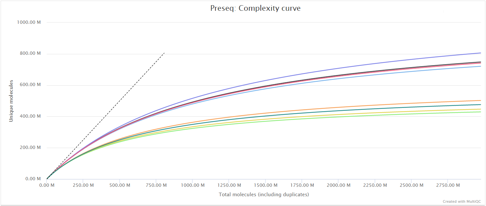

### featureCounts

<details markdown="1">
<summary>Output files</summary>

- `<ALIGNER>/featurecounts/`
  - `*.featureCounts.txt`: featureCounts biotype-level quantification results for each sample.
  - `*.featureCounts.txt.summary`: featureCounts summary file containing overall statistics about the counts.
  - `*_mqc.tsv`: MultiQC custom content files used to plot biotypes in report.

</details>

[featureCounts](http://bioinf.wehi.edu.au/featureCounts/) from the [Subread](http://subread.sourceforge.net/) package is a quantification tool used to summarise the mapped read distribution over genomic features such as genes, exons, promotors, gene bodies, genomic bins and chromosomal locations. We can also use featureCounts to count overlaps with different classes of genomic features. This provides an additional QC to check which features are most abundant in the sample, and to highlight potential problems such as rRNA contamination.


### DESeq2

<details markdown="1">
<summary>Output files</summary>

- `<ALIGNER/PSEUDOALIGNER>/deseq2_qc/`
  - `*.plots.pdf`: File containing PCA and hierarchical clustering plots.
  - `*.dds.RData`: File containing R `DESeqDataSet` object generated
    by DESeq2, with either an rlog or vst `assay` storing the
    variance-stabilised data.
  - `*.rds`: Alternative version of the RData file suitable for
    `readRDS` to give user control of the eventual object name.
  - `*pca.vals.txt`: Matrix of values for the first 2 principal components.
  - `*sample.dists.txt`: Sample distance matrix.
  - `R_sessionInfo.log`: File containing information about R, the OS and attached or loaded packages.
- `<ALIGNER/PSEUDOALIGNER>/deseq2_qc/size_factors/`
  - `*.txt`, `*.RData`: Files containing DESeq2 sizeFactors per sample.

</details>

[DESeq2](https://bioconductor.org/packages/release/bioc/vignettes/DESeq2/inst/doc/DESeq2.html) is one of the most commonly used software packages to perform differential expression analysis for RNA-seq datasets.

**This pipeline uses a standardised DESeq2 analysis script to get an idea of the reproducibility across samples within the experiment. Please note that this will not suit every experimental design, and if there are other problems with the experiment then it may not work as well as expected.**

The script included in the pipeline uses DESeq2 to normalise read counts across all of the provided samples in order to create a PCA plot and a clustered heatmap showing pairwise Euclidean distances between the samples in the experiment. These help to show the similarity between groups of samples and can reveal batch effects and other potential issues with the experiment.

By default, the pipeline uses the `vst` transformation which is more suited to larger experiments. You can set the parameter `--deseq2_vst false` if you wish to use the DESeq2 native `rlog` option. See [DESeq2 docs](http://bioconductor.org/packages/devel/bioc/vignettes/DESeq2/inst/doc/DESeq2.html#data-transformations-and-visualization) for a more detailed explanation.

Both types of transformation are performed blind, i.e. using across-all-samples variability, without using any prior information on experimental groups (equivalent to using an intercept-only design), as recommended by the [DESeq2 docs](https://www.bioconductor.org/packages/release/bioc/vignettes/DESeq2/inst/doc/DESeq2.html#blind-dispersion-estimation).

The PCA plots are generated based alternately on the top five hundred most variable genes, or all genes. The former is the conventional approach that is more likely to pick up strong effects (ie the biological signal) and the latter, when different, is picking up a weaker but consistent effect that is synchronised across many transcripts. We project both of these onto the first two PCs (shown in the top row of the figure below), which is the best two dimensional representation of the variation between samples.

We also explore higher components in terms of experimental factors inferred from sample names. If your sample naming convention follows a strict policy of using underscores to delimit values of experimental factors (for example `WT_UNTREATED_REP1`) and all names have the same number of underscores (so excluding `WT_TREATED_10ml_REP1` from being compatible with the previous label), then any of these factors that are informative (ie label some but not all samples the same) then we individually plot upto the first five PCs, per experimental level, for each of the experimental factors.

The plot on the left hand side shows the standard PC plot - notice the variable number of underscores, meaning that the central plot would not be produced: here we have changed the underscore that is hyphenating the treatment to a '-' character. This allows the central plot to be generated, and we can see that replicate (the 2nd part of the sample name) seems to be affecting the 3rd principal component, but the treatment factor is affecting the more important first two components. The right-most plot shows all pairwise euclidean distances between the samples.

<p align="center">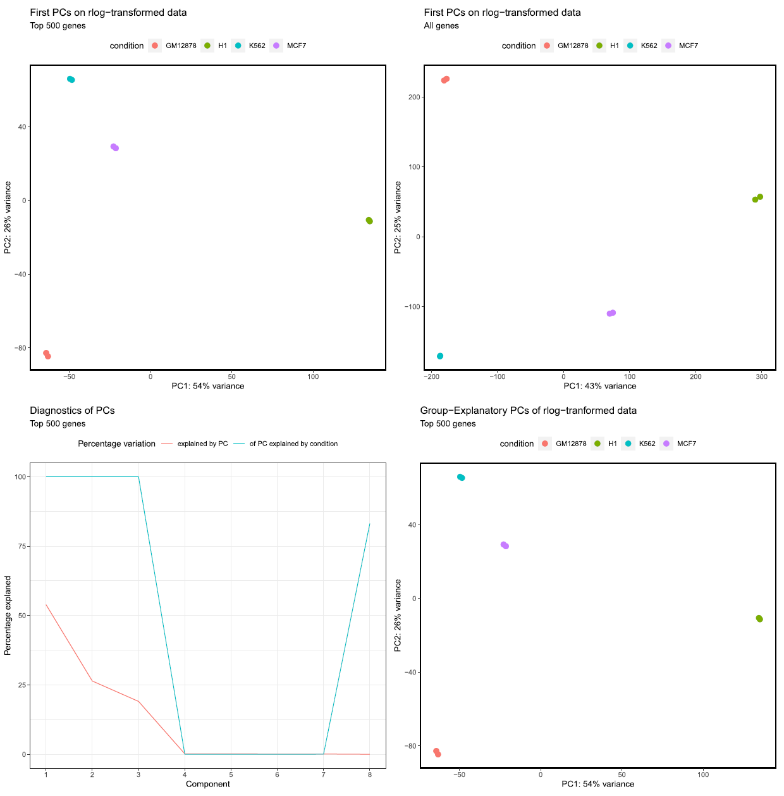</p>


<p align="center">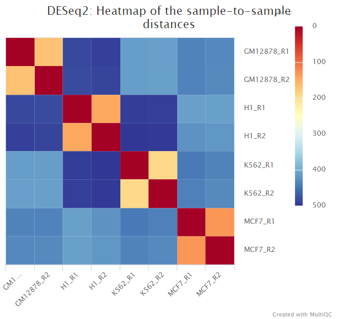</p>

### MultiQC

<details markdown="1">
<summary>Output files</summary>

- `multiqc/<ALIGNER>/`
  - `multiqc_report.html`: a standalone HTML file that can be viewed in your web browser.
  - `multiqc_data/`: directory containing parsed statistics from the different tools used in the pipeline.

</details>

[MultiQC](http://multiqc.info) is a visualization tool that generates a single HTML report summarising all samples in your project. Most of the pipeline QC results are visualised in the report and further statistics are available in the report data directory.

Results generated by MultiQC collate pipeline QC from supported tools i.e. FastQC, Cutadapt, SortMeRNA, STAR, RSEM, HISAT2, Salmon, SAMtools, Picard, RSeQC, Qualimap, Preseq and featureCounts. Additionally, various custom content has been added to the report to assess the output of dupRadar, DESeq2 and featureCounts biotypes, and to highlight samples failing a mimimum mapping threshold or those that failed to match the strand-specificity provided in the input samplesheet. The pipeline has special steps which also allow the software versions to be reported in the MultiQC output for future traceability. For more information about how to use MultiQC reports, see <http://multiqc.info>.

## Pseudoalignment and quantification

### Pseudoalignment

The principal output files are the same between Salmon and Kallsto:

<details markdown="1">
<summary>Output files</summary>

- `<pseudo_aligner>/`
  - `<pseudo_aligner>.merged.gene_counts.tsv`: Matrix of gene-level raw counts across all samples.
  - `<pseudo_aligner>.gene_tpm.tsv`: Matrix of gene-level TPM values across all samples.
  - `<pseudo_aligner>.gene_counts.rds`: RDS object that can be loaded in R that contains a [SummarizedExperiment](https://bioconductor.org/packages/release/bioc/html/SummarizedExperiment.html) container with the TPM (`abundance`), estimated counts (`counts`) and transcript length (`length`) in the assays slot for genes.
  - `<pseudo_aligner>.merged.gene_lengths.tsv`: Matrix of average within-sample transcript lengths for each gene across all samples.
  - `<pseudo_aligner>.merged.gene_counts_scaled.tsv`: Matrix of gene-level library size-scaled estimated counts across all samples.
  - `<pseudo_aligner>.merged.gene_counts_scaled.rds`: RDS object that can be loaded in R that contains a [SummarizedExperiment](https://bioconductor.org/packages/release/bioc/html/SummarizedExperiment.html) container with the TPM (`abundance`), estimated library size-scaled counts (`counts`) and transcript length (`length`) in the assays slot for genes.
  - `<pseudo_aligner>.merged.gene_counts_length_scaled.tsv`: Matrix of gene-level length-scaled estimated counts across all samples.
  - `<pseudo_aligner>.merged.gene_counts_length_scaled.rds`: RDS object that can be loaded in R that contains a [SummarizedExperiment](https://bioconductor.org/packages/release/bioc/html/SummarizedExperiment.html) container with the TPM (`abundance`), estimated length-scaled counts (`counts`) and transcript length (`length`) in the assays slot for genes.
  - `<pseudo_aligner>.merged.transcript_counts.tsv`: Matrix of isoform-level raw counts across all samples.
  - `<pseudo_aligner>.merged.transcript_tpm.tsv`: Matrix of isoform-level TPM values across all samples.
  - `<pseudo_aligner>.merged.transcript_counts.rds`: RDS object that can be loaded in R that contains a [SummarizedExperiment](https://bioconductor.org/packages/release/bioc/html/SummarizedExperiment.html) container with the TPM (`abundance`), estimated isoform-level raw counts (`counts`) and transcript length (`length`) in the assays slot for transcripts.
  - `tx2gene.tsv`: Tab-delimited file containing gene to transcripts ids mappings.
  </details>

An additional subset of files are distinct to each tool, for Salmon:

<details markdown="1">
<summary>Output files</summary>

- `salmon/<SAMPLE>/`
  - `aux_info/`: Auxiliary info e.g. versions and number of mapped reads.
  - `cmd_info.json`: Information about the Salmon quantification command, version and options.
  - `lib_format_counts.json`: Number of fragments assigned, unassigned and incompatible.
  - `libParams/`: Contains the file `flenDist.txt` for the fragment length distribution.
  - `logs/`: Contains the file `salmon_quant.log` giving a record of Salmon's quantification.
  - `quant.genes.sf`: Salmon _gene_-level quantification of the sample, including feature length, effective length, TPM, and number of reads.
  - `quant.sf`: Salmon _transcript_-level quantification of the sample, including feature length, effective length, TPM, and number of reads.
  </details>

... and Kallisto:

<details markdown="1">
<summary>Output files</summary>

- `kallisto/<SAMPLE>/`
  - `abundance.h5`: a HDF5 binary file containing run info, abundance esimates, bootstrap estimates, and transcript length information length. This file can be read in by [sleuth](https://pachterlab.github.io/sleuth/about).
  - `abundance.tsv`: a plaintext file of the abundance estimates. It does not contains bootstrap estimates.
  - `run_info.json`: a json file containing information about the run.
  - `kallisto_quant.log`: standard output from the Kallisto process per sample.
  </details>

As described in the [STAR and Salmon](#star-and-salmon) section, you can choose to pseudoalign and quantify your data with [Salmon](https://salmon.readthedocs.io/en/latest/salmon.html) or [Kallisto](https://pachterlab.github.io/kallisto/) by providing the `--pseudo_aligner` parameter. By default, Salmon is run in addition to the standard alignment workflow defined by `--aligner`, mainly because it allows you to obtain QC metrics with respect to the genomic alignments. However, you can provide the `--skip_alignment` parameter if you would like to run Salmon or Kallisto in isolation. If Salmon or Kallisto are run in isolation, the outputs mentioned above will be found in a folder named `salmon` or `kallisto`. If Salmon is run alongside STAR, the folder will be named `star_salmon`.

Transcripts with large inferential uncertainty won't be assigned the exact number of reads reproducibly, every time Salmon is run. Read more about this on the [nf-core/rnaseq](https://github.com/nf-core/rnaseq/issues/585) and [salmon](https://github.com/COMBINE-lab/salmon/issues/613) Github repos.

The [tximport](https://bioconductor.org/packages/release/bioc/html/tximport.html) package is used in this pipeline to summarise the results generated by Salmon or Kallisto into matrices for use with downstream differential analysis packages. We use tximport with different options to summarize count and TPM quantifications at the gene- and transcript-level. Please see [#499](https://github.com/nf-core/rnaseq/issues/499) for discussion and links regarding which counts are suitable for different types of analysis.

According to the [`txtimport` documentation](https://bioconductor.org/packages/release/bioc/vignettes/tximport/inst/doc/tximport.html#Downstream_DGE_in_Bioconductor) you can do one of the following:

- Use the original (bias-uncorrected) counts _with an offset_: import all the salmon `quant.sf` files with `tximport` and then use `DESeq2` with `dds <- DESeqDataSetFromTximport(txi, sampleTable, ~condition)` to automatically construct an object with gene-level offsets in-built, which can be used by DESeq2 to automatically account for effective gene length effects across conditions. It's also possible to combine the `.merged.gene_counts.tsv` and `.gene_lengths.tsv` matrices output by this workflow to make your own object the same way - which is what [the nf-core differentialabundance workflow does](https://nf-co.re/differentialabundance/1.5.0/docs/usage#outputs-from-nf-corernaseq-and-other-tximport-processed-results). See the [DESeq2 module](https://github.com/nf-core/modules/blob/c8f7f481bf2ccd8f9c7f2d499d94e74d4b9e23ab/modules/nf-core/deseq2/differential/templates/deseq_de.R#L323) for the implementation details.
- Use bias-corrected counts _without an offset_: load and use `salmon.merged.gene_counts_length_scaled.tsv` or `salmon.merged.gene_counts_scaled.tsv` directly as you would with a regular gene-level counts matrix. These files were created using the `tximport` argument `countsFromAbundance="scaledTPM"` or `"lengthScaledTPM"` to scale counts to library size or to library size and average transcript length respectively.
- Use the original (bias-uncorrected) counts _without an offset_: load and use the `txi$counts` matrix (or `salmon.merged.gene_counts.tsv`) with `DESeq2`. This is generally **not** recommended, since it does not correct for potential differential isoform usage (the offset). However, if you have 3’ tagged RNA-seq data, then this _is_ the most suitable method, because the counts do not exhibit any length bias.

> **NB:** The default Salmon parameters and a k-mer size of 31 are used to create the index. As [documented here](https://salmon.readthedocs.io/en/latest/salmon.html#preparing-transcriptome-indices-mapping-based-mode) and [discussed here](https://github.com/COMBINE-lab/salmon/issues/482#issuecomment-583799668), a k-mer size off 31 works well with reads that are 75bp or longer.

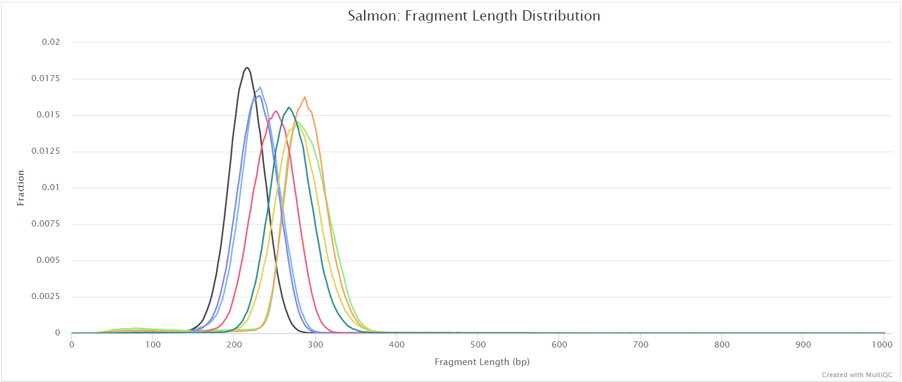

## Workflow reporting and genomes

### Reference genome files

<details markdown="1">
<summary>Output files</summary>

- `genome/`
  - `*.fa`, `*.gtf`, `*.gff`, `*.bed`, `.tsv`: If the `--save_reference` parameter is provided then all of the genome reference files will be placed in this directory.
- `genome/index/`
  - `star/`: Directory containing STAR indices.
  - `hisat2/`: Directory containing HISAT2 indices.
  - `rsem/`: Directory containing STAR and RSEM indices.
  - `salmon/`: Directory containing Salmon indices.
  - `kallisto/`: Directory containing Kallisto indices.

</details>

A number of genome-specific files are generated by the pipeline because they are required for the downstream processing of the results. If the `--save_reference` parameter is provided then these will be saved in the `genome/` directory. It is recommended to use the `--save_reference` parameter if you are using the pipeline to build new indices so that you can save them somewhere locally. The index building step can be quite a time-consuming process and it permits their reuse for future runs of the pipeline to save disk space.

### Pipeline information

<details markdown="1">
<summary>Output files</summary>

- `pipeline_info/`
  - Reports generated by Nextflow: `execution_report.html`, `execution_timeline.html`, `execution_trace.txt` and `pipeline_dag.dot`/`pipeline_dag.svg`.
  - Reports generated by the pipeline: `pipeline_report.html`, `pipeline_report.txt` and `software_versions.yml`. The `pipeline_report*` files will only be present if the `--email` / `--email_on_fail` parameter's are used when running the pipeline.
  - Reformatted samplesheet files used as input to the pipeline: `samplesheet.valid.csv`.
  - Parameters used by the pipeline run: `params.json`.

</details>

[Nextflow](https://www.nextflow.io/docs/latest/tracing.html) provides excellent functionality for generating various reports relevant to the running and execution of the pipeline. This will allow you to troubleshoot errors with the running of the pipeline, and also provide you with other information such as launch commands, run times and resource usage.
