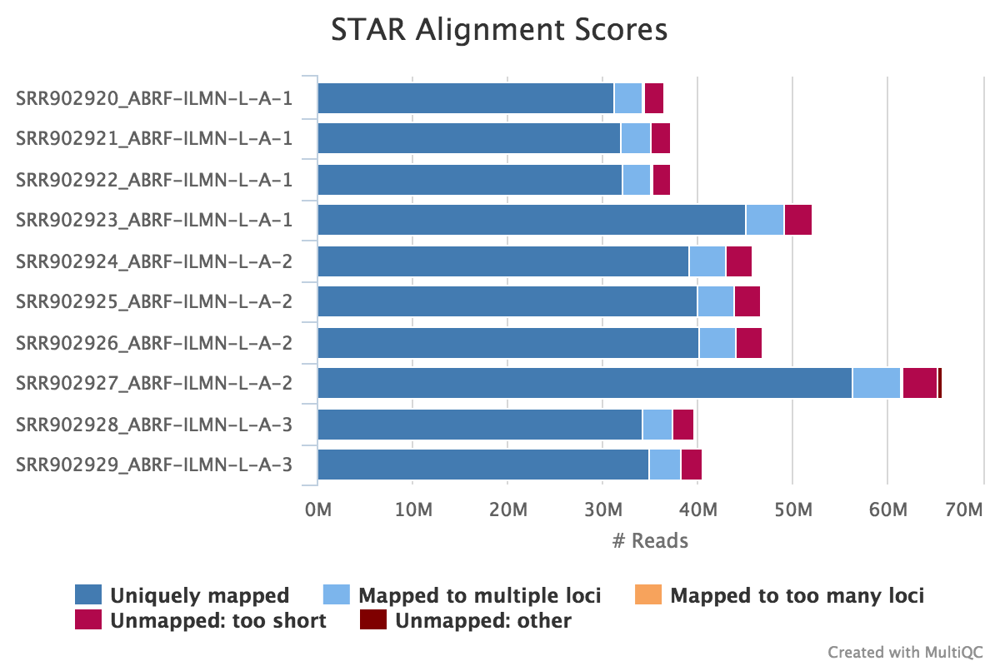
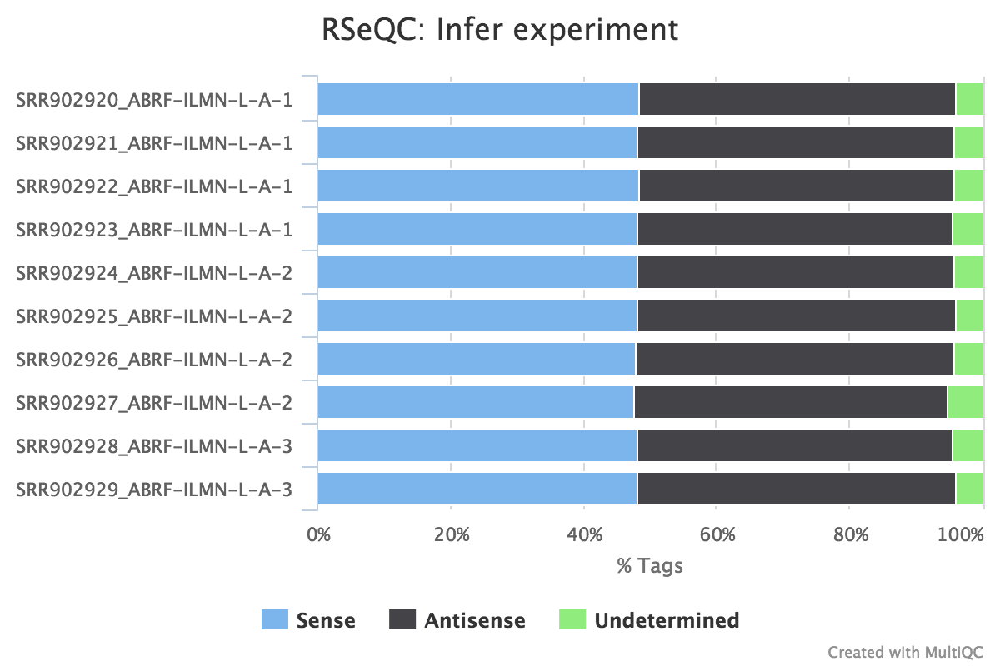
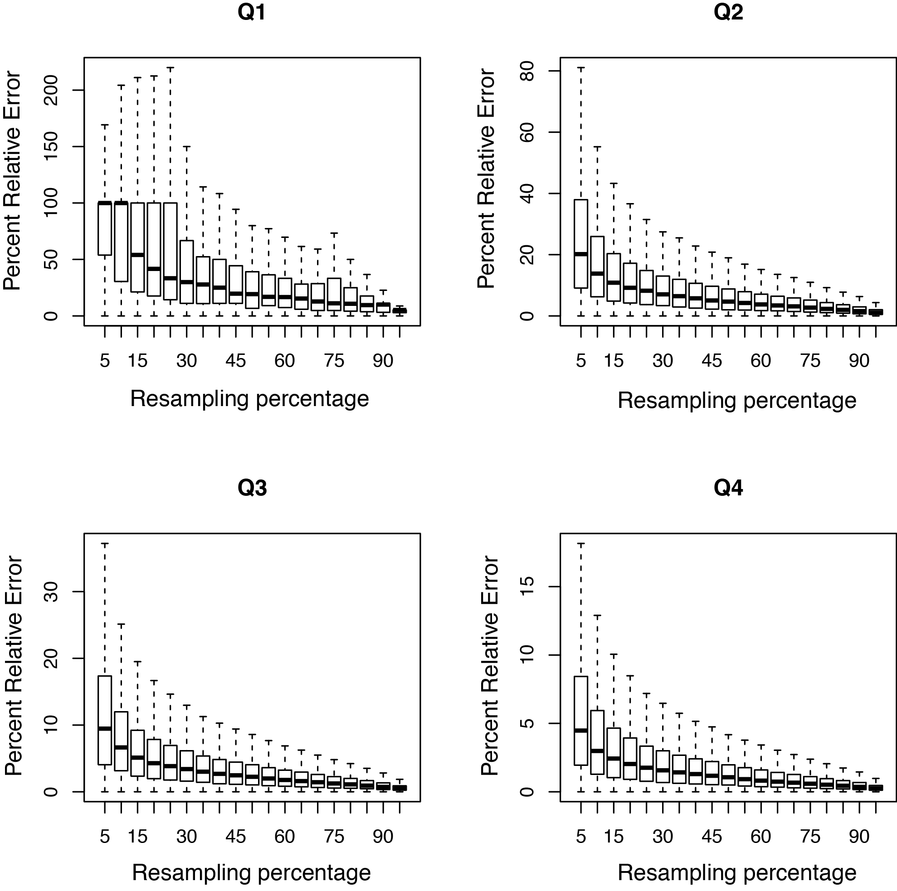
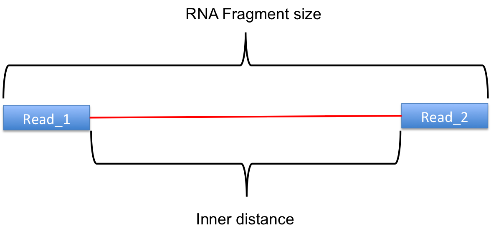
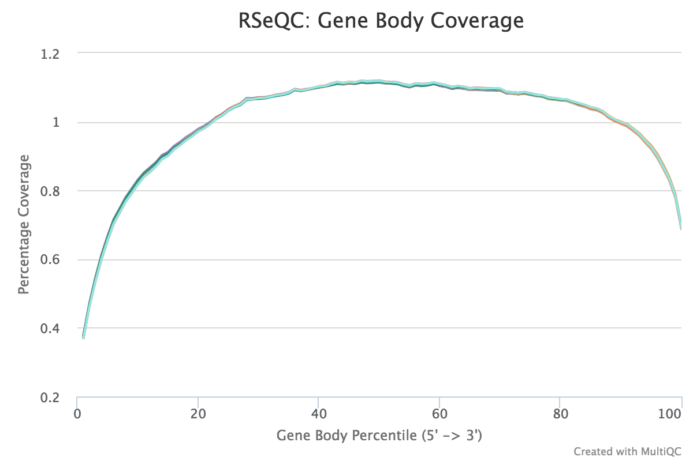
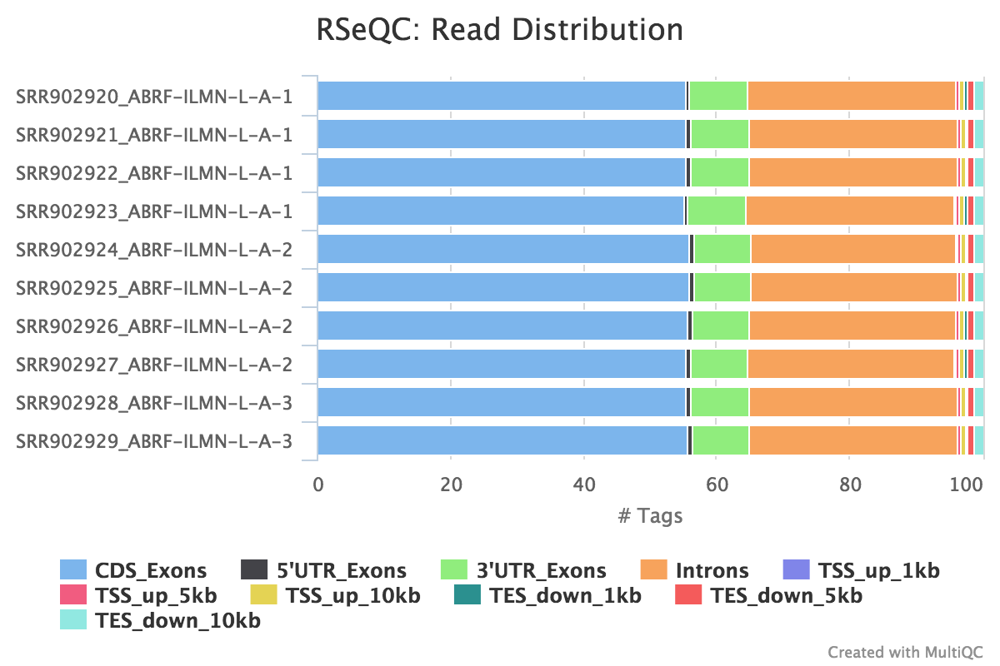
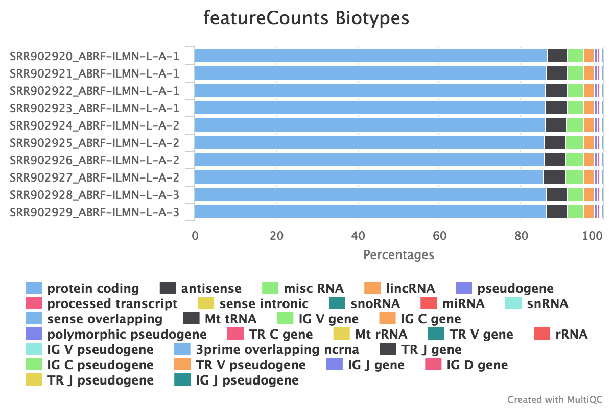
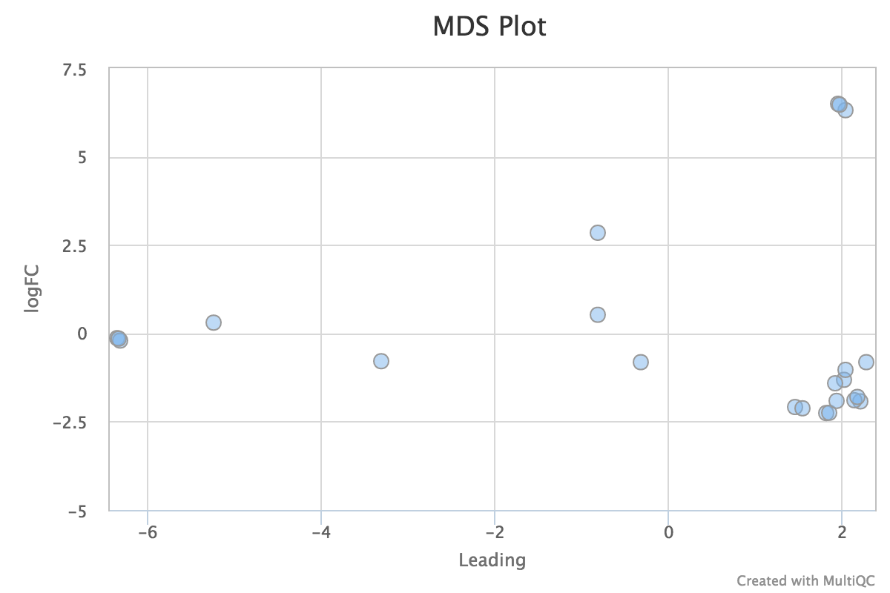

# nf-core/rnaseq: Output

This document describes the output produced by the pipeline. Most of the plots are taken from the MultiQC report, which summarises results at the end of the pipeline.

## Pipeline overview
The pipeline is built using [Nextflow](https://www.nextflow.io/)
and processes data using the following steps:

* [FastQC](#fastqc) - read quality control
* [TrimGalore](#trimgalore) - adapter trimming
* [STAR](#star) - alignment
* [RSeQC](#rseqc) - RNA quality control metrics
  * [BAM stat](#bam-stat)
  * [Infer experiment](#infer-experiment)
  * [Junction saturation](#junction-saturation)
  * [RPKM saturation](#rpkm-saturation)
  * [Read duplication](#read-duplication)
  * [Inner distance](#inner-distance)
  * [Gene body coverage](#gene-body-coverage)
  * [Read distribution](#read-distribution)
  * [Junction annotation](#junction-annotation)
* [dupRadar](#dupradar) - technical / biological read duplication
* [Preseq](#preseq) - library complexity
* [featureCounts](#featurecounts) - gene counts, biotype counts, rRNA estimation.
* [StringTie](#stringtie) - FPKMs for genes and transcripts
* [Sample_correlation](#Sample_correlation) - create MDS plot and sample pairwise distance heatmap / dendrogram
* [MultiQC](#multiqc) - aggregate report, describing results of the whole pipeline

## FastQC
[FastQC](http://www.bioinformatics.babraham.ac.uk/projects/fastqc/) gives general quality metrics about your reads. It provides information about the quality score distribution across your reads, the per base sequence content (%T/A/G/C). You get information about adapter contamination and other overrepresented sequences.

For further reading and documentation see the [FastQC help](http://www.bioinformatics.babraham.ac.uk/projects/fastqc/Help/).

> **NB:** The FastQC plots displayed in the MultiQC report shows _untrimmed_ reads. They may contain adapter sequence and potentially regions with low quality. To see how your reads look after trimming, look at the FastQC reports in the `trim_galore` directory.

**Output directory: `results/fastqc`**

* `sample_fastqc.html`
  * FastQC report, containing quality metrics for your untrimmed raw fastq files
* `zips/sample_fastqc.zip`
  * zip file containing the FastQC report, tab-delimited data file and plot images

## TrimGalore
The nfcore/rnaseq pipeline uses [TrimGalore](http://www.bioinformatics.babraham.ac.uk/projects/trim_galore/) for removal of adapter contamination and trimming of low quality regions. TrimGalore uses [Cutadapt](https://github.com/marcelm/cutadapt) for adapter trimming and runs FastQC after it finishes.

MultiQC reports the percentage of bases removed by TrimGalore in the _General Statistics_ table, along with a line plot showing where reads were trimmed.

**Output directory: `results/trim_galore`**

Contains FastQ files with quality and adapter trimmed reads for each sample, along with a log file describing the trimming.

* `sample_val_1.fq.gz`, `sample_val_2.fq.gz`
  * Trimmed FastQ data, reads 1 and 2.
  * NB: Only saved if `--saveTrimmed` has been specified.
* `logs/sample_val_1.fq.gz_trimming_report.txt`
  * Trimming report (describes which parameters that were used)
* `FastQC/sample_val_1_fastqc.zip`
  * FastQC report for trimmed reads

Single-end data will have slightly different file names and only one FastQ file per sample.

## STAR
STAR is a read aligner designed for RNA sequencing.  STAR stands for Spliced Transcripts Alignment to a Reference, it produces results comparable to TopHat (the aligned previously used by NGI for RNA alignments) but is much faster.

The STAR section of the MultiQC report shows a bar plot with alignment rates: good samples should have most reads as _Uniquely mapped_ and few _Unmapped_ reads.



**Output directory: `results/STAR`**

* `Sample_Aligned.sortedByCoord.out.bam`
  * The aligned BAM file
* `Sample_Log.final.out`
  * The STAR alignment report, contains mapping results summary
* `Sample_Log.out` and `Sample_Log.progress.out`
  * STAR log files, containing a lot of detailed information about the run. Typically only useful for debugging purposes.
* `Sample_SJ.out.tab`
  * Filtered splice junctions detected in the mapping


## RSeQC
RSeQC is a package of scripts designed to evaluate the quality of RNA seq data. You can find out more about the package at the [RSeQC website](http://rseqc.sourceforge.net/).

This pipeline runs several, but not all RSeQC scripts. All of these results are summarised within the MultiQC report and described below.

**Output directory: `results/rseqc`**

These are all quality metrics files and contains the raw data used for the plots in the MultiQC report. In general, the `.r` files are R scripts for generating the figures, the `.txt` are summary files, the `.xls` are data tables and the `.pdf` files are summary figures.

### BAM stat
**Output: `Sample_bam_stat.txt`**

This script gives numerous statistics about the aligned BAM files produced by STAR. A typical output looks as follows:

```txt
#Output (all numbers are read count)
#==================================================
Total records:                                 41465027
QC failed:                                     0
Optical/PCR duplicate:                         0
Non Primary Hits                               8720455
Unmapped reads:                                0

mapq < mapq_cut (non-unique):                  3127757
mapq >= mapq_cut (unique):                     29616815
Read-1:                                        14841738
Read-2:                                        14775077
Reads map to '+':                              14805391
Reads map to '-':                              14811424
Non-splice reads:                              25455360
Splice reads:                                  4161455
Reads mapped in proper pairs:                  21856264
Proper-paired reads map to different chrom:    7648
```

MultiQC plots each of these statistics in a dot plot. Each sample in the project is a dot - hover to see the sample highlighted across all fields.

RSeQC documentation: [bam_stat.py](http://rseqc.sourceforge.net/#bam-stat-py)

### Infer experiment
**Output: `Sample_infer_experiment.txt`**

This script predicts the mode of library preparation (sense-stranded or antisense-stranded) according to how aligned reads overlay gene features in the reference genome.
Example output from an unstranded (~50% sense/antisense) library of paired end data:

**From MultiQC report:**


**From the `infer_experiment.txt` file:**

```txt
This is PairEnd Data
Fraction of reads failed to determine: 0.0409
Fraction of reads explained by "1++,1--,2+-,2-+": 0.4839
Fraction of reads explained by "1+-,1-+,2++,2--": 0.4752
```

RSeQC documentation: [infer_experiment.py](http://rseqc.sourceforge.net/#infer-experiment-py)


### Junction saturation
**Output:**
* `Sample_rseqc.junctionSaturation_plot.pdf`
* `Sample_rseqc.junctionSaturation_plot.r`

This script shows the number of splice sites detected at the data at various levels of subsampling. A sample that reaches a plateau before getting to 100% data indicates that all junctions in the library have been detected, and that further sequencing will not yield more observations. A good sample should approach such a plateau of _Known junctions_, very deep sequencing is typically requires to saturate all _Novel Junctions_ in a sample.

None of the lines in this example have plateaued and thus these samples could reveal more alternative splicing information if they were sequenced deeper.


RSeQC documentation: [junction_saturation.py](http://rseqc.sourceforge.net/#junction-saturation-py)

### RPKM saturation
**Output:**

* `Sample_RPKM_saturation.eRPKM.xls`
* `Sample_RPKM_saturation.rawCount.xls`
* `Sample_RPKM_saturation.saturation.pdf`
* `Sample_RPKM_saturation.saturation.r`

This tool resamples a subset of the total RNA reads and calculates the RPKM value for each subset. We use the default subsets of every 5% of the total reads.
A percent relative error is then calculated based on the subsamples; this is the y-axis in the graph. A typical PDF figure looks as follows:



A complex library will have low resampling error in well expressed genes.

This data is not currently reported in the MultiQC report.

RSeQC documentation: [RPKM_saturation.py](http://rseqc.sourceforge.net/#rpkm-saturation-py)


### Read duplication
**Output:**

* `Sample_read_duplication.DupRate_plot.pdf`
* `Sample_read_duplication.DupRate_plot.r`
* `Sample_read_duplication.pos.DupRate.xls`
* `Sample_read_duplication.seq.DupRate.xls`

This plot shows the number of reads (y-axis) with a given number of exact duplicates (x-axis). Most reads in an RNA-seq library should have a low number of exact duplicates. Samples which have many reads with many duplicates (a large area under the curve) may be suffering excessive technical duplication.


RSeQC documentation: [read_duplication.py](http://rseqc.sourceforge.net/#read-duplication-py)

### Inner distance
**Output:**

* `Sample_rseqc.inner_distance.txt`
* `Sample_rseqc.inner_distance_freq.txt`
* `Sample_rseqc.inner_distance_plot.r`

The inner distance script tries to calculate the inner distance between two paired RNA reads. It is the distance between the end of read 1 to the start of read 2,
and it is sometimes confused with the insert size (see [this blog post](http://thegenomefactory.blogspot.com.au/2013/08/paired-end-read-confusion-library.html) for disambiguation):

> _Credit: modified from RSeQC documentation._

Note that values can be negative if the reads overlap. A typical set of samples may look like this:


This plot will not be generated for single-end data. Very short inner distances are often seen in old or degraded samples (_eg._ FFPE).

RSeQC documentation: [inner_distance.py](http://rseqc.sourceforge.net/#inner-distance-py)

### Gene body coverage
**NB:** In nfcore/rnaseq we subsample this to 1 Million reads. This speeds up this task significantly and has no to little effect on the results.

**Output:**

* `Sample_rseqc.geneBodyCoverage.curves.pdf`
* `Sample_rseqc.geneBodyCoverage.r`
* `Sample_rseqc.geneBodyCoverage.txt`

This script calculates the reads coverage across gene bodies. This makes it easy to identify 3' or 5' skew in libraries. A skew towards increased 3' coverage can happen in degraded samples prepared with poly-A selection.

A typical set of libraries with little or no bias will look as follows:



RSeQC documentation: [gene\_body_coverage.py](http://rseqc.sourceforge.net/#genebody-coverage-py)


### Read distribution
**Output: `Sample_read_distribution.txt`**

This tool calculates how mapped reads are distributed over genomic features. A good result for a standard RNA seq experiments is generally to have as many exonic reads as possible (`CDS_Exons`). A large amount of intronic reads could be indicative of DNA contamination in your sample or some other problem.



RSeQC documentation: [read_distribution.py](http://rseqc.sourceforge.net/#read-distribution-py)


### Junction annotation
**Output:**

* `Sample_junction_annotation_log.txt`
* `Sample_rseqc.junction.xls`
* `Sample_rseqc.junction_plot.r`
* `Sample_rseqc.splice_events.pdf`
* `Sample_rseqc.splice_junction.pdf`

Junction annotation compares detected splice junctions to a reference gene model. An RNA read can be spliced 2 or more times, each time is called a splicing event.


RSeQC documentation: [junction_annotation.py](http://rseqc.sourceforge.net/#junction-annotation-py)

## dupRadar
[dupRadar](https://www.bioconductor.org/packages/release/bioc/html/dupRadar.html) is a Bioconductor library for R. It plots the duplication rate against expression (RPKM) for every gene. A good sample with little technical duplication will only show high numbers of duplicates for highly expressed genes. Samples with technical duplication will have high duplication for all genes, irrespective of transcription level.


> _Credit: [dupRadar documentation](https://www.bioconductor.org/packages/devel/bioc/vignettes/dupRadar/inst/doc/dupRadar.html)_

**Output directory: `results/dupRadar`**

* `Sample_markDups.bam_duprateExpDens.pdf`
* `Sample_markDups.bam_duprateExpBoxplot.pdf`
* `Sample_markDups.bam_expressionHist.pdf`
* `Sample_markDups.bam_dupMatrix.txt`
* `Sample_markDups.bam_duprateExpDensCurve.txt`
* `Sample_markDups.bam_intercept_slope.txt`

DupRadar documentation: [dupRadar docs](https://www.bioconductor.org/packages/devel/bioc/vignettes/dupRadar/inst/doc/dupRadar.html)

## Preseq
[Preseq](http://smithlabresearch.org/software/preseq/) estimates the complexity of a library, showing how many additional unique reads are sequenced for increasing the total read count. A shallow curve indicates that the library has reached complexity saturation and further sequencing would likely not add further unique reads. The dashed line shows a perfectly complex library where total reads = unique reads.

Note that these are predictive numbers only, not absolute. The MultiQC plot can sometimes give extreme sequencing depth on the X axis - click and drag from the left side of the plot to zoom in on more realistic numbers.


**Output directory: `results/preseq`**

* `sample_ccurve.txt`
  * This file contains plot values for the complexity curve, plotted in the MultiQC report.

## featureCounts
[featureCounts](http://bioinf.wehi.edu.au/featureCounts/) from the subread package summarises the read distribution over genomic features such as genes, exons, promotors, gene bodies, genomic bins and chromosomal locations.
RNA reads should mostly overlap genes, so be assigned.


We also use featureCounts to count overlaps with different classes of features. This gives a good idea of where aligned reads are ending up and can show potential problems such as rRNA contamination.


**Output directory: `results/featureCounts`**

* `Sample.bam_biotype_counts.txt`
  * Read counts for the different gene biotypes that featureCounts distinguishes.
* `Sample.featureCounts.txt`
  * Read the counts for each gene provided in the reference `gtf` file
* `Sample.featureCounts.txt.summary`
  * Summary file, containing statistics about the counts

## StringTie
[StringTie](https://ccb.jhu.edu/software/stringtie/) assembles RNA-Seq alignments into potential transcripts. It assembles and quantitates full-length transcripts representing multiple splice variants for each gene locus.

StringTie outputs FPKM metrics for genes and transcripts as well as the transcript features that it generates.

**Output directory: `results/stringtie`**

* `<sample>_Aligned.sortedByCoord.out.bam.gene_abund.txt`
  * Gene aboundances, FPKM values
* `<sample>_Aligned.sortedByCoord.out.bam_transcripts.gtf`
  * This `.gtf` file contains all of the assembled transcipts from StringTie
* `<sample>_Aligned.sortedByCoord.out.bam.cov_refs.gtf`
  * This `.gtf` file contains the transcripts that are fully covered by reads.

## Sample Correlation
[edgeR](https://bioconductor.org/packages/release/bioc/html/edgeR.html) is a Bioconductor package for R used for RNA-seq data analysis. The script included in the pipeline uses edgeR to normalise read counts and create a heatmap / dendrogram showing pairwise euclidean distance (sample similarity). It also creates a 2D MDS scatter plot showing sample grouping. These help to show sample similarity and can reveal batch effects and sample groupings.

**Heatmap:**


**MDS plot:**



**Output directory: `results/sample_correlation`**

* `edgeR_MDS_plot.pdf`
  * MDS scatter plot, showing sample similarity
* `edgeR_MDS_distance_matrix.txt`
  * Distance matrix containing raw data from MDS analysis
* `edgeR_MDS_plot_coordinates.txt`
  * Scatter plot coordinates from MDS plot, used for MultiQC report
* `log2CPM_sample_distances_dendrogram.pdf`
  * Dendrogram plot showing the euclidian distance between your samples
* `log2CPM_sample_distances_heatmap.pdf`
  * Heatmap plot showing the euclidian distance between your samples
* `log2CPM_sample_distances.txt`
  * Raw data used for heatmap and dendrogram plots.

## MultiQC
[MultiQC](http://multiqc.info) is a visualisation tool that generates a single HTML report summarising all samples in your project. Most of the pipeline QC results are visualised in the report and further statistics are available in within the report data directory.

The pipeline has special steps which allow the software versions used to be reported in the MultiQC output for future traceability.

**Output directory: `results/multiqc`**

* `Project_multiqc_report.html`
  * MultiQC report - a standalone HTML file that can be viewed in your web browser
* `Project_multiqc_data/`
  * Directory containing parsed statistics from the different tools used in the pipeline

For more information about how to use MultiQC reports, see [http://multiqc.info](http://multiqc.info)
