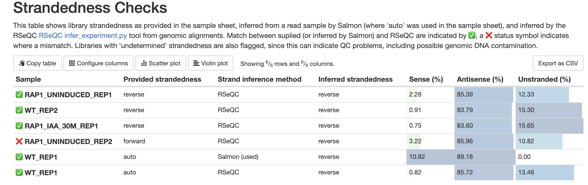

# nf-core/rnaseq: Usage

## :warning: Please read this documentation on the nf-core website: [https://nf-co.re/rnaseq/usage](https://nf-co.re/rnaseq/usage)

> _Documentation of pipeline parameters is generated automatically from the pipeline schema and can no longer be found in markdown files._

## Pipeline parameters

Please provide pipeline parameters via the CLI or Nextflow `-params-file` option. Custom config files including those provided by the `-c` Nextflow option can be used to provide any configuration except for parameters; see [docs](https://nf-co.re/usage/configuration#custom-configuration-files).

## Samplesheet input

You will need to create a samplesheet with information about the samples you would like to analyse before running the pipeline. Use this parameter to specify its location. It has to be a comma-separated file with 4 columns, and a header row as shown in the examples below.

```bash
--input '[path to samplesheet file]'
```

### Multiple runs of the same sample

The `sample` identifiers have to be the same when you have re-sequenced the same sample more than once e.g. to increase sequencing depth. The pipeline will concatenate the raw reads before performing any downstream analysis. Below is an example for the same sample sequenced across 3 lanes.

```csv title="samplesheet.csv"
sample,fastq_1,fastq_2,strandedness
CONTROL_REP1,AEG588A1_S1_L002_R1_001.fastq.gz,AEG588A1_S1_L002_R2_001.fastq.gz,auto
CONTROL_REP1,AEG588A1_S1_L003_R1_001.fastq.gz,AEG588A1_S1_L003_R2_001.fastq.gz,auto
CONTROL_REP1,AEG588A1_S1_L004_R1_001.fastq.gz,AEG588A1_S1_L004_R2_001.fastq.gz,auto
```

### Strandedness Prediction

If you set the strandedness value to `auto`, the pipeline will sub-sample the input FastQ files to 1 million reads, use Salmon Quant to automatically infer the strandedness, and then propagate this information through the rest of the pipeline. This behavior is controlled by the `--stranded_threshold` and `--unstranded_threshold` parameters, which are set to 0.8 and 0.1 by default, respectively. This means:

- **Forward stranded:** At least 80% of the fragments are in the 'forward' orientation.
- **Unstranded:** The forward and reverse fractions differ by less than 10%.
- **Undetermined:** Samples that do not meet either criterion, possibly indicating issues such as genomic DNA contamination.

**Note:** These thresholds apply to both the strandedness inferred from Salmon outputs for input to the pipeline and how strandedness is inferred from RSeQC results using pipeline outputs.

#### Usage Examples

1. **Forward Stranded Sample:**

   - Forward fraction: 0.85
   - Reverse fraction: 0.15
   - **Classification:** Forward stranded

2. **Reverse Stranded Sample:**

   - Forward fraction: 0.1
   - Reverse fraction: 0.9
   - **Classification:** Reverse stranded

3. **Unstranded Sample:**

   - Forward fraction: 0.45
   - Reverse fraction: 0.55
   - **Classification:** Unstranded

4. **Undetermined Sample:**
   - Forward fraction: 0.6
   - Reverse fraction: 0.4
   - **Classification:** Undetermined

You can control the stringency of this behavior with `--stranded_threshold` and `--unstranded_threshold`.

#### Errors and Reporting

The results of strandedness inference are displayed in the MultiQC report under 'Strandedness Checks'. This shows any provided strandedness and the results inferred by both Salmon (when strandedness is set to 'auto') and RSeQC. Mismatches between input strandedness (explicitly provided by the user or inferred by Salmon) and output strandedness from RSeQC are marked as fails. For example, if a user specifies 'forward' as strandedness for a library that is actually reverse stranded, this is marked as a fail.



Be sure to check the strandedness report when reviewing the QC for your samples.

### Full samplesheet

The pipeline will auto-detect whether a sample is single- or paired-end using the information provided in the samplesheet. The samplesheet can have as many columns as you desire, however, there is a strict requirement for the first 4 columns to match those defined in the table below.

A final samplesheet file consisting of both single- and paired-end data may look something like the one below. This is for 6 samples, where `TREATMENT_REP3` has been sequenced twice.

```csv title="samplesheet.csv"
sample,fastq_1,fastq_2,strandedness
CONTROL_REP1,AEG588A1_S1_L002_R1_001.fastq.gz,AEG588A1_S1_L002_R2_001.fastq.gz,forward
CONTROL_REP2,AEG588A2_S2_L002_R1_001.fastq.gz,AEG588A2_S2_L002_R2_001.fastq.gz,forward
CONTROL_REP3,AEG588A3_S3_L002_R1_001.fastq.gz,AEG588A3_S3_L002_R2_001.fastq.gz,forward
TREATMENT_REP1,AEG588A4_S4_L003_R1_001.fastq.gz,,reverse
TREATMENT_REP2,AEG588A5_S5_L003_R1_001.fastq.gz,,reverse
TREATMENT_REP3,AEG588A6_S6_L003_R1_001.fastq.gz,,reverse
TREATMENT_REP3,AEG588A6_S6_L004_R1_001.fastq.gz,,reverse
```

| Column         | Description                                                                                                                                                                            |
| -------------- | -------------------------------------------------------------------------------------------------------------------------------------------------------------------------------------- |
| `sample`       | Custom sample name. This entry will be identical for multiple sequencing libraries/runs from the same sample. Spaces in sample names are automatically converted to underscores (`_`). |
| `fastq_1`      | Full path to FastQ file for Illumina short reads 1. File has to be gzipped and have the extension ".fastq.gz" or ".fq.gz".                                                             |
| `fastq_2`      | Full path to FastQ file for Illumina short reads 2. File has to be gzipped and have the extension ".fastq.gz" or ".fq.gz".                                                             |
| `strandedness` | Sample strand-specificity. Must be one of `unstranded`, `forward`, `reverse` or `auto`.                                                                                                |

An [example samplesheet](../assets/samplesheet.csv) has been provided with the pipeline.

> **NB:** The `group` and `replicate` columns were replaced with a single `sample` column as of v3.1 of the pipeline. The `sample` column is essentially a concatenation of the `group` and `replicate` columns, however it now also offers more flexibility in instances where replicate information is not required e.g. when sequencing clinical samples. If all values of `sample` have the same number of underscores, fields defined by these underscore-separated names may be used in the PCA plots produced by the pipeline, to regain the ability to represent different groupings.

## FASTQ sampling

If you would like to reduce the number of reads used in the analysis, for example to test pipeline operation with limited resource usage, you can make use of the FASTP option for trimming (see below). FASTP has an option to take the first `n` reads of input FASTQ file(s), so this can be used to reduce the reads passed to subsequent steps. For example, to pass only the first 10,000 reads for trimming you would set input paramters like:

```
--trimmer fastp --extra_fastp_args '--reads_to_process 10000'
```

## Adapter trimming options

[Trim Galore!](https://www.bioinformatics.babraham.ac.uk/projects/trim_galore/) is a wrapper tool around Cutadapt and FastQC to peform quality and adapter trimming on FastQ files. Trim Galore! will automatically detect and trim the appropriate adapter sequence. It is the default trimming tool used by this pipeline, however you can use fastp instead by specifying the `--trimmer fastp` parameter. [fastp](https://github.com/OpenGene/fastp) is a tool designed to provide fast, all-in-one preprocessing for FastQ files. It has been developed in C++ with multithreading support to achieve higher performance. You can specify additional options for Trim Galore! and fastp via the `--extra_trimgalore_args` and `--extra_fastp_args` parameters, respectively.

> **NB:** TrimGalore! will only run using multiple cores if you are able to use more than > 5 and > 6 CPUs for single- and paired-end data, respectively. The total cores available to TrimGalore! will also be capped at 4 (7 and 8 CPUs in total for single- and paired-end data, respectively) because there is no longer a run-time benefit. See [release notes](https://github.com/FelixKrueger/TrimGalore/blob/master/Changelog.md#version-060-release-on-1-mar-2019) and [discussion whilst adding this logic to the nf-core/atacseq pipeline](https://github.com/nf-core/atacseq/pull/65).

## Alignment options

:::note
The `--aligner hisat2` option is not currently supported using ARM architecture ('-profile arm')
:::

By default, the pipeline uses [STAR](https://github.com/alexdobin/STAR) (i.e. `--aligner star_salmon`) to map the raw FastQ reads to the reference genome, project the alignments onto the transcriptome and to perform the downstream BAM-level quantification with [Salmon](https://salmon.readthedocs.io/en/latest/salmon.html). STAR is fast but requires a lot of memory to run, typically around 38GB for the Human GRCh37 reference genome. Since the [RSEM](https://github.com/deweylab/RSEM) (i.e. `--aligner star_rsem`) workflow in the pipeline also uses STAR you should use the [HISAT2](https://ccb.jhu.edu/software/hisat2/index.shtml) aligner (i.e. `--aligner hisat2`) if you have memory limitations.

You also have the option to pseudoalign and quantify your data directly with [Salmon](https://salmon.readthedocs.io/en/latest/salmon.html) or [Kallisto](https://pachterlab.github.io/kallisto/) by specifying `salmon` or `kallisto` to the `--pseudo_aligner` parameter. The selected pseudoaligner will then be run in addition to the standard alignment workflow defined by `--aligner`, mainly because it allows you to obtain QC metrics with respect to the genomic alignments. However, you can provide the `--skip_alignment` parameter if you would like to run Salmon or Kallisto in isolation. By default, the pipeline will use the genome fasta and gtf file to generate the transcripts fasta file, and then to build the Salmon index. You can override these parameters using the `--transcript_fasta` and `--salmon_index` parameters, respectively.

The library preparation protocol (library type) used by Salmon quantification is inferred by the pipeline based on the information provided in the samplesheet, however, you can override it using the `--salmon_quant_libtype` parameter. You can find the available options in the [Salmon documentation](https://salmon.readthedocs.io/en/latest/library_type.html). Similarly, strandedness is taken from the sample sheet or calculated automatically, and passed to Kallisto on a per-library basis, but you can apply a global override by setting the Kallisto strandedness parameters in `--extra_kallisto_quant_args` like `--extra_kallisto_quant_args '--fr-stranded'` see the [Kallisto documentation](https://pachterlab.github.io/kallisto/manual).

When running Salmon in mapping-based mode via `--pseudo_aligner salmon` the entire genome of the organism is used by default for the decoy-aware transcriptome when creating the indices (see second bulleted option in [Salmon documentation](https://salmon.readthedocs.io/en/latest/salmon.html#preparing-transcriptome-indices-mapping-based-mode)).

Two additional parameters `--extra_star_align_args` and `--extra_salmon_quant_args` were added in v3.10 of the pipeline that allow you to append any custom parameters to the STAR align and Salmon quant commands, respectively. Note, the `--seqBias` and `--gcBias` are not provided to Salmon quant by default so you can provide these via `--extra_salmon_quant_args '--seqBias --gcBias'` if required. You can now also supply additional arguments to Kallisto via `--extra_kallisto_quant_args`.

> **NB:** You can use `--skip_alignment --skip_pseudo_alignment` if you only want to run the pre-processing QC steps in the pipeline like FastQ, trimming etc. This will skip alignment, pseudoalignment and any post-alignment processing steps.

## Quantification options

The current options align with STAR and quantify using either Salmon (`--aligner star_salmon`) / RSEM (`--aligner star_rsem`). You also have the option to pseudoalign and quantify your data with Salmon or Kallisto by providing the `--pseudo_aligner salmon` or `--pseudo_aligner kallisto` parameter, respectively.

Since v3.0 of the pipeline, featureCounts is no longer used to perform gene/transcript quantification, however it is still used to generate QC metrics based on [biotype](http://www.ensembl.org/info/genome/genebuild/biotypes.html) information available within GFF/GTF genome annotation files. This decision was made primarily because of the limitations of featureCounts to appropriately quantify gene expression data. Please see [Zhao et al., 2015](https://journals.plos.org/plosone/article?id=10.1371/journal.pone.0141910#pone-0141910-t001) and [Soneson et al., 2015](https://f1000research.com/articles/4-1521/v1).

For similar reasons, quantification will not be performed if using `--aligner hisat2` due to the lack of an appropriate option to calculate accurate expression estimates from HISAT2 derived genomic alignments - this may change in future releases (see [#822](https://github.com/nf-core/rnaseq/issues/822)). HISAT2 has been made available for those who have a preference for the alignment, QC and other types of downstream analysis compatible with it's output.

### Unique Molecular Identifiers (UMI)

The pipeline supports Unique Molecular Identifiers to increase the accuracy of the quantification. UMIs are short sequences used to uniquely tag each molecule in a sample library and facilitate the accurate identification of read duplicates. They must be added during library preparation and prior to sequencing, therefore require appropriate arrangements with your sequencing provider.

To take UMIs into consideration during a workflow run, specify the `--with_umi` parameter. The pipeline currently supports UMIs, which are embedded within a read's sequence and UMIs, whose sequence is given inside the read's name. Please consult your kit's manual and/or contact your sequencing provider regarding the exact specification.

The `--umitools_grouping_method` parameter affects [how similar, but non-identical UMIs](https://umi-tools.readthedocs.io/en/latest/reference/dedup.html#method) are treated. `directional`, the default setting, is most accurate, but computationally very demanding. Consider `percentile` or `unique` if processing many samples.

#### Examples:

| UMI type     | Source                                                                                                                                                                                                                                                                                                                              | Pipeline parameters                                                                                                                                                         |
| ------------ | ----------------------------------------------------------------------------------------------------------------------------------------------------------------------------------------------------------------------------------------------------------------------------------------------------------------------------------- | --------------------------------------------------------------------------------------------------------------------------------------------------------------------------- |
| In read name | [Illumina BCL convert >3.7.5](https://emea.support.illumina.com/content/dam/illumina-support/documents/documentation/software_documentation/bcl_convert/bcl-convert-v3-7-5-software-guide-1000000163594-00.pdf)                                                                                                                     | `--with_umi --skip_umi_extract --umitools_umi_separator ":"`                                                                                                                |
| In sequence  | [Lexogen QuantSeq® 3’ mRNA-Seq V2 FWD](https://www.lexogen.com/quantseq-3mrna-sequencing) + [UMI Second Strand Synthesis Module](https://faqs.lexogen.com/faq/how-can-i-add-umis-to-my-quantseq-libraries)                                                                                                                         | `--with_umi --umitools_extract_method "regex" --umitools_bc_pattern "^(?P<umi_1>.{6})(?P<discard_1>.{4}).*"`                                                                |
| In sequence  | [Lexogen CORALL® Total RNA-Seq V1](https://www.lexogen.com/corall-total-rna-seq/)<br> > _mind [Appendix H](https://www.lexogen.com/wp-content/uploads/2020/04/095UG190V0130_CORALL-Total-RNA-Seq_2020-03-31.pdf) regarding optional trimming_                                                                                      | `--with_umi --umitools_extract_method "regex" --umitools_bc_pattern "^(?P<umi_1>.{12}).*"`<br>Optional: `--clip_r2 9 --three_prime_clip_r2 12`                              |
| In sequence  | [Takara Bio SMARTer® Stranded Total RNA-Seq Kit v3](https://www.takarabio.com/documents/User%20Manual/SMARTer%20Stranded%20Total%20RNA/SMARTer%20Stranded%20Total%20RNA-Seq%20Kit%20v3%20-%20Pico%20Input%20Mammalian%20User%20Manual-a_114949.pdf)                                                                                | `--with_umi --umitools_extract_method "regex" --umitools_bc_pattern2 "^(?P<umi_1>.{8})(?P<discard_1>.{6}).*"`                                                               |
| In sequence  | [Watchmaker mRNA Library Prep Kit](https://watchmakergenomics.com/wp-content/uploads/2023/11/M223_mRNA-Library-Prep-Kit-_UG_WMUG214_v1-1-0823.pdf) with [Twist UMI Adapter System](https://www.twistbioscience.com/sites/default/files/resources/2023-03/DOC-001337_TechNote-ProcessingSequencingDataUtilizingUMI-REV1-singles.pdf) | `--with_umi --umitools_extract_method "regex" --umitools_bc_pattern "^(?P<umi_1>.{5})(?P<discard_1>.{2}).*" --umitools_bc_pattern2 "^(?P<umi_2>.{5})(?P<discard_2>.{2}).*"` |

> _No warranty for the accuracy or completeness of the parameters is implied_

### 3′ digital gene expression assays

Some bulk RNA-seq library preparation protocols capture only a 3' tag from each transcript, e.g. [3'Pool-seq](https://pubmed.ncbi.nlm.nih.gov/31959126/), [DRUG-seq](https://pubs.acs.org/doi/10.1021/acschembio.1c00920), [BRB-seq](https://genomebiology.biomedcentral.com/articles/10.1186/s13059-019-1671-x) or Lexogen's commercial [QuantSeq 3' mRNA-seq FWD](https://www.lexogen.com/quantseq-3mrna-sequencing/) protocol. The following parameters have been validated for `QuantSeq 3' mRNA-seq FWD` data, and provide useful starting points for other 3' RNA-seq protocols:

#### Custom STAR parameters

Lexogen provides an example analysis workflow [on their website](https://www.lexogen.com/quantseq-data-analysis/), which includes the _ENCODE standard options_ for the [STAR aligner](<[https://github.com/alexdobin/STAR/blob/master/doc/STARmanual.pdf](https://github.com/alexdobin/STAR)>). In addition, Lexogen also decreases the tolerance for mismatches and clips poly(A) tails. To apply these settings, add the following parameters when running the pipeline:

```
--extra_star_align_args "--alignIntronMax 1000000 --alignIntronMin 20 --alignMatesGapMax 1000000 --alignSJoverhangMin 8 --outFilterMismatchNmax 999 --outFilterMultimapNmax 20 --outFilterType BySJout --outFilterMismatchNoverLmax 0.1 --clip3pAdapterSeq AAAAAAAA"
```

#### Custom Salmon arguments

[Salmon's default quantitation algorithm](https://www.nature.com/articles/nmeth.4197) takes into account transcript length.
Because 3' tag protocols do not capture full transcripts, this feature needs to be deactivated by specifying:

```
--extra_salmon_quant_args "--noLengthCorrection"
```

#### QuantSeq analysis with UMIs

If unique molecular identifiers were used to prepare the library, add the following arguments as well, to extract the UMIs and deduplicated alignments:

```
--with_umi
--umitools_extract_method regex
--umitools_bc_pattern "^(?P<umi_1>.{6})(?P<discard_1>.{4}).*"
```

## Reference genome options

Please refer to the [nf-core website](https://nf-co.re/usage/reference_genomes) for general usage docs and guidelines regarding reference genomes.

:::note
**Consistent reference resource usage**

When supplying reference files as discussed below, it is important to be consistent in the reference resource used (Ensembl, GENCODE, UCSC etc), since differences in conventions between these resources can make their files incompatible. For example, UCSC prefixes chromosomes with `chr`, while Ensembl does not, so a GTF file from Ensembl should not be supplied alongside a genome FASTA from UCSC. GENCODE also attaches version identifiers to gene and transcript names (e.g. `ENSG00000254647.1`) while Ensembl does not.
:::

### Explicit reference file specification (recommended)

The minimum reference genome requirements for this pipeline are a FASTA and GTF file, all other files required to run the pipeline can be generated from these files. For example, the latest reference files for human can be derived from Ensembl like:

```
latest_release=$(curl -s 'http://rest.ensembl.org/info/software?content-type=application/json' | grep -o '"release":[0-9]*' | cut -d: -f2)
wget -L ftp://ftp.ensembl.org/pub/release-${latest_release}/fasta/homo_sapiens/dna/Homo_sapiens.GRCh38.dna_sm.primary_assembly.fa.gz
wget -L ftp://ftp.ensembl.org/pub/release-${latest_release}/gtf/homo_sapiens/Homo_sapiens.GRCh38.${latest_release}.gtf.gz
```

These files can then be specified to the workflow with the `--fasta` and `--gtf` parameters.

Notes:

- Compressed reference files are supported by the pipeline i.e. standard files with the `.gz` extension and indices folders with the `tar.gz` extension.

- If `--gff` is provided as input then this will be converted to a GTF file, or the latter will be used if both are provided.
- If `--gene_bed` is not provided then it will be generated from the GTF file.
- If `--additional_fasta` is provided then the features in this file (e.g. ERCC spike-ins) will be automatically concatenated onto both the reference FASTA file as well as the GTF annotation before building the appropriate indices.
- When using `--aligner star_rsem`, both the STAR and RSEM indices should be present in the path specified by `--rsem_index` (see [#568](https://github.com/nf-core/rnaseq/issues/568)).

#### Reference genome

It is recommended to provide the most complete reference genome for your species, without additional loci (haplotypes) or patches. For model organisms such as mouse or human, this is the "primary assembly", which includes the reference chromosomes and some additional scaffolds. For the human assembly GRCh38 (hg38), use the `GRCh38.primary_assembly.genome.fa.gz` file from GENCODE or the `Homo_sapiens.GRCh38.dna.primary_assembly.fa.gz` file from Ensembl. These files cover the largest portion of the reference genome without including multiple copies of the same sequence, which would result in heavy mapping quality penalties.

For most other species (e.g., fly, cow, dog), no primary assembly is published. This reflects inadequately characterized genomic variation and a lower degree of curation, meaning that there are no established alternative loci (haplotypes), and that the toplevel file is equivalent to a primary assembly. Therefore, while the toplevel assembly may be utilized for these organisms, it is nonetheless advisable to verify the absence of N-padded haplotype or patch regions first.

#### Gene annotation

Gene annotations are updated more frequently than the reference genome sequence, so you must choose an appropriate annotation version (e.g. Ensembl release). We recommend using sources with well-defined, versioned releases such as ENSEMBL or GENCODE. Generally, it is best to use the most recent release for the latest gene annotations. However, if you are combining your data with older datasets, use the annotation version previously used for consistency.

Once you have chosen a release, select the annotation file that matches your reference genome. For the human primary assembly, use the comprehensive annotation (e.g., `gencode.{release}.primary_assembly.annotation.gtf.gz` from GENCODE or `Homo_sapiens.GRCh38.{release}.gtf.gz` from Ensembl). For other species, like fly, use the annotation matching the toplevel assembly (e.g., `Drosophila_melanogaster.BDGP6.46.{release}.gtf.gz` from Ensembl).

Ensure that the annotation files use gene IDs as the primary identifier, not the gene name/symbol. For example, the Ensembl ID `ENSG00000254647` corresponds to the `INS` gene, which encodes the insulin protein. While gene names are more familiar, it is crucial to retain and use the primary identifiers as they are unique and easier to map between annotation versions or sources.

To take advantage of all the quality control modules implemented in the pipeline, the gene annotation should include a `gene_biotype` field which describes the function of each feature (protein coding, long non-coding etc.). This is usually the case for annotations from GENCODE or Ensembl but may not be if your annotation comes from another source. If your annotation does not include this field, please set the `--skip_biotype_qc` option to avoid running the steps that rely on it.

:::note
**GTF vs GFF**

GFF (General Feature Format) is a tab-separated text file format for representing genomic annotations, while GTF (General Transfer Format) is a specific implementation of this format corresponding to GFF version 2. The pipeline can accept both GFF and GTF but any GFF files will be converted to GTF so if a GTF is available for your annotation of choice it is better to provide that directly.

More information and links to further resources are [available from Ensembl](https://www.ensembl.org/info/website/upload/gff.html).
:::

#### Reference transcriptome

In addition to the reference genome sequence and annotation, you can provide a reference transcriptome FASTA file. These files can be obtained from GENCODE or Ensembl. However, these sequences only cover the reference chromosomes and can cause inconsistencies if you are using a primary or toplevel genome assembly and annotation.

We recommend not providing a transcriptome FASTA file and instead allowing the pipeline to create it from the provided genome and annotation. Similar to aligner indexes, you can save the created transcriptome FASTA and BED files to a central location for future pipeline runs. This helps avoid redundant computation and having multiple copies on your system. Ensure that all genome, annotation, transcriptome, and index versions match to maintain consistency.

#### Indices

By default, indices are generated dynamically by the workflow for tools such as STAR and Salmon. Since indexing is an expensive process in time and resources you should ensure that it is only done once, by retaining the indices generated from each batch of reference files:

- the `--save_reference` parameter will save your indices in your results directory
- the `--skip_alignment --skip_pseudo_alignment` will disable other processes if you'd like to do an 'indexing only' workflow run.

Once you have the indices from a workflow run you should save them somewhere central and reuse them in subsequent runs using custom config files or command line parameters such as `--star_index '/path/to/STAR/index/'`.

Remember to note the genome and annotation versions as well as the versions of the software used for indexing, as an index created with one version may not be compatible with other versions.

#### GENCODE

If you are using [GENCODE](https://www.gencodegenes.org/) reference genome files please specify the `--gencode` parameter because the format of these files is slightly different to ENSEMBL genome files:

- The `--gtf_group_features_type` parameter will automatically be set to `gene_type` as opposed to `gene_biotype`, respectively.
- If you are running Salmon, the `--gencode` flag will also be passed to the index building step to overcome parsing issues resulting from the transcript IDs in GENCODE fasta files being separated by vertical pipes (`|`) instead of spaces (see [this issue](https://github.com/COMBINE-lab/salmon/issues/15)).

As well as the standard annotations, GENCODE also provides "basic" annotations, which include only representative transcripts, but we do not recommend using these.

#### Prokaryotic genome annotations

This pipeline uses featureCounts to generate QC metrics based on [biotype](http://www.ensembl.org/info/genome/genebuild/biotypes.html) information available within GFF/GTF genome annotation files. The format of these annotation files can vary significantly depending on the source of the annotation and the type of organism. The default settings in the pipeline are tailored towards Ensembl GTF annotations available for eukaryotic genomes. Prokaryotic genome annotations tend to be distributed in GFF format which are structured differently in terms of the feature naming conventions. There are a number of ways you can tune the behaviour of the pipeline to cater for differences/absence of biotype information:

- Use `--skip_biotype_qc` to bypass this step altogether in case biotype information is of no interest or isn't present in your annotation file.
- Use `--skip_rseqc` since features like splice junctions, transcription start (TSS) and ending sites (TES) are less prevalent and therefore, less informative in prokaryotes compared to eukaryotes.
- Use `--featurecounts_feature_type transcript` instead of `--featurecounts_feature_type transcript exon` (default) since entries for the latter may not contain a `--featurecounts_group_type gene_biotype` entry in the last column of the annotation. You should make sure that the value defined by `--featurecounts_feature_type` ideally contain corresponding entries for `featurecounts_group_type`.
- Use `--featurecounts_feature_type 'CDS' --featurecounts_group_type 'product'` to identify the number of hypothetical proteins. However, the featureCounts QC will no longer reflect the biotype information from your RNA.

Please get in touch with us on the #rnaseq channel in the [nf-core Slack workspace](https://nf-co.re/join) if you are having problems or need any advice.

### iGenomes (not recommended)

If the `--genome` parameter is provided (e.g. `--genome GRCh37`) then the FASTA and GTF files (and existing indices) will be automatically obtained from AWS-iGenomes unless these have already been downloaded locally in the path specified by `--igenomes_base`.

However this is no longer recommended because:

- Gene annotations in iGenomes are extremely out of date. This can be particularly problematic for RNA-seq analysis, which relies on accurate gene annotation.
- Some iGenomes references (e.g., GRCh38) point to annotation files that use gene symbols as the primary identifier. This can cause issues for downstream analysis, such as the nf-core [differential abundance](https://nf-co.re/differentialabundance) workflow where a conventional gene identifier distinct from symbol is expected.

Notes:

- As of v3.7 of the pipeline, if you are using a genome downloaded from AWS iGenomes and using `--aligner star_salmon` (default) the version of STAR to use for the alignment will be auto-detected (see [#808](https://github.com/nf-core/rnaseq/issues/808)).

### GTF filtering

By default, the input GTF file will be filtered to ensure that sequence names correspond to those in the genome fasta file, and to remove rows with empty transcript identifiers. Filtering can be bypassed completely where you are confident it is not necessary, using the `--skip_gtf_filter` parameter. If you just want to skip the 'transcript_id' checking component of the GTF filtering script used in the pipeline this can be disabled specifically using the `--skip_gtf_transcript_filter` parameter.

## Contamination screening options

:::note
The `--contaminant_screening` option is not currently available using ARM architecture ('-profile arm')
:::

The pipeline provides the option to scan unaligned reads for contamination from other species using [Kraken2](https://ccb.jhu.edu/software/kraken2/), with the possibility of applying corrections from [Bracken](https://ccb.jhu.edu/software/bracken/). Since running Bracken is not computationally expensive, we recommend always using it to refine the abundance estimates generated by Kraken2.

It is important to note that the accuracy of Kraken2 is [highly dependent on the database](https://doi.org/10.1099/mgen.0.000949) used. Specifically, it is [crucial](https://doi.org/10.1128/mbio.01607-23) to ensure that the host genome is included in the database. If you are particularly concerned about certain contaminants, it may be beneficial to use a smaller, more focused database containing primarily those contaminants instead of the full standard database. Various pre-built databases [are available for download](https://benlangmead.github.io/aws-indexes/k2), and instructions for building a custom database can be found in the [Kraken2 documentation](https://github.com/DerrickWood/kraken2/blob/master/docs/MANUAL.markdown). Additionally, genomes of contaminants detected in previous sequencing experiments are available on the [OpenContami website](https://openlooper.hgc.jp/opencontami/help/help_oct.php).

While Kraken2 is capable of detecting low-abundance contaminants in a sample, false positives can occur. Therefore, if only a very small number of reads from a contaminating species are detected, these results should be interpreted with caution.

## Running the pipeline

The typical command for running the pipeline is as follows:

```bash
nextflow run \
    nf-core/rnaseq \
    --input <SAMPLESHEET> \
    --outdir <OUTDIR> \
    --gtf <GTF> \
    --fasta <GENOME FASTA> \
    -profile docker
```

> **NB:** Loading iGenomes configuration remains the default for reasons of consistency with other workflows, but should be disabled when not using iGenomes, applying the recommended usage above.

This will launch the pipeline with the `docker` configuration profile. See below for more information about profiles.

Note that the pipeline will create the following files in your working directory:

```bash
work                # Directory containing the nextflow working files
<OUTDIR>            # Finished results in specified location (defined with --outdir)
.nextflow_log       # Log file from Nextflow
# Other nextflow hidden files, eg. history of pipeline runs and old logs.
```

If you wish to repeatedly use the same parameters for multiple runs, rather than specifying each flag in the command, you can specify these in a params file.

Pipeline settings can be provided in a `yaml` or `json` file via `-params-file <file>`.

:::warning
Do not use `-c <file>` to specify parameters as this will result in errors. Custom config files specified with `-c` must only be used for [tuning process resource specifications](https://nf-co.re/docs/usage/configuration#tuning-workflow-resources), other infrastructural tweaks (such as output directories), or module arguments (args).
:::

The above pipeline run specified with a params file in yaml format:

```bash
nextflow run nf-core/rnaseq -profile docker -params-file params.yaml
```

with:

```yaml
input: <SAMPLESHEET>
outdir: <OUTDIR>
genome: 'GRCh37'
<...>
```

You can also generate such `YAML`/`JSON` files via [nf-core/launch](https://nf-co.re/launch).

### Running on Linux ARM architectures

:::warning
Please note that the ARM profile is experimental. It is expected to function correctly in all cases unless explicitly indicated otherwise—currently, exceptions include the use of the hisat2 aligner and contaminant screening via kraken2. However, because testing is presently conducted manually, we cannot guarantee its reliability.
:::

The pipeline can be executed in an ARM compatible mode by specifying the ARM profile, for example:

```bash
nextflow run \
    nf-core/rnaseq \
    --input <SAMPLESHEET> \
    --outdir <OUTDIR> \
    --gtf <GTF> \
    --fasta <GENOME FASTA> \
    -profile docker,arm
```

This will use ARM-compatible containers, and apply a small number of overrides to Conda definitions to support ARM operations.

### Updating the pipeline

When you run the above command, Nextflow automatically pulls the pipeline code from GitHub and stores it as a cached version. When running the pipeline after this, it will always use the cached version if available - even if the pipeline has been updated since. To make sure that you're running the latest version of the pipeline, make sure that you regularly update the cached version of the pipeline:

```bash
nextflow pull nf-core/rnaseq
```

### Reproducibility

It is a good idea to specify a pipeline version when running the pipeline on your data. This ensures that a specific version of the pipeline code and software are used when you run your pipeline. If you keep using the same tag, you'll be running the same version of the pipeline, even if there have been changes to the code since.

First, go to the [nf-core/rnaseq releases page](https://github.com/nf-core/rnaseq/releases) and find the latest pipeline version - numeric only (eg. `1.3.1`). Then specify this when running the pipeline with `-r` (one hyphen) - eg. `-r 1.3.1`. Of course, you can switch to another version by changing the number after the `-r` flag.

This version number will be logged in reports when you run the pipeline, so that you'll know what you used when you look back in the future. For example, at the bottom of the MultiQC reports.

To further assist in reproducbility, you can use share and re-use [parameter files](#running-the-pipeline) to repeat pipeline runs with the same settings without having to write out a command with every single parameter.

:::tip
If you wish to share such profile (such as upload as supplementary material for academic publications), make sure to NOT include cluster specific paths to files, nor institutional specific profiles.
:::

## Core Nextflow arguments

:::note
These options are part of Nextflow and use a _single_ hyphen (pipeline parameters use a double-hyphen).
:::

### `-profile`

Use this parameter to choose a configuration profile. Profiles can give configuration presets for different compute environments.

Several generic profiles are bundled with the pipeline which instruct the pipeline to use software packaged using different methods (Docker, Singularity, Podman, Shifter, Charliecloud, Apptainer, Conda) - see below.

:::info
We highly recommend the use of Docker or Singularity containers for full pipeline reproducibility, however when this is not possible, Conda is also supported.
:::

The pipeline also dynamically loads configurations from [https://github.com/nf-core/configs](https://github.com/nf-core/configs) when it runs, making multiple config profiles for various institutional clusters available at run time. For more information and to see if your system is available in these configs please see the [nf-core/configs documentation](https://github.com/nf-core/configs#documentation).

Note that multiple profiles can be loaded, for example: `-profile test,docker` - the order of arguments is important!
They are loaded in sequence, so later profiles can overwrite earlier profiles.

If `-profile` is not specified, the pipeline will run locally and expect all software to be installed and available on the `PATH`. This is _not_ recommended, since it can lead to different results on different machines dependent on the computer enviroment.

- `test`
  - A profile with a complete configuration for automated testing
  - Includes links to test data so needs no other parameters
- `docker`
  - A generic configuration profile to be used with [Docker](https://docker.com/)
- `singularity`
  - A generic configuration profile to be used with [Singularity](https://sylabs.io/docs/)
- `podman`
  - A generic configuration profile to be used with [Podman](https://podman.io/)
- `shifter`
  - A generic configuration profile to be used with [Shifter](https://nersc.gitlab.io/development/shifter/how-to-use/)
- `charliecloud`
  - A generic configuration profile to be used with [Charliecloud](https://hpc.github.io/charliecloud/)
- `apptainer`
  - A generic configuration profile to be used with [Apptainer](https://apptainer.org/)
- `wave`
  - A generic configuration profile to enable [Wave](https://seqera.io/wave/) containers. Use together with one of the above (requires Nextflow ` 24.03.0-edge` or later).
- `conda`
  - A generic configuration profile to be used with [Conda](https://conda.io/docs/). Please only use Conda as a last resort i.e. when it's not possible to run the pipeline with Docker, Singularity, Podman, Shifter, Charliecloud, or Apptainer.
- `arm`
  - A configuration profile that will set `docker.runOptions` appropriately for ARM architectures, and apply overrides supplying ARM-compatible containers and Conda environments. See [Running on Linux ARM architectures](#running-on-linux-arm-architectures).

### `-resume`

Specify this when restarting a pipeline. Nextflow will use cached results from any pipeline steps where the inputs are the same, continuing from where it got to previously. For input to be considered the same, not only the names must be identical but the files' contents as well. For more info about this parameter, see [this blog post](https://www.nextflow.io/blog/2019/demystifying-nextflow-resume.html).

You can also supply a run name to resume a specific run: `-resume [run-name]`. Use the `nextflow log` command to show previous run names.

### `-c`

Specify the path to a specific config file (this is a core Nextflow command). See the [nf-core website documentation](https://nf-co.re/usage/configuration) for more information.

## Custom configuration

### Resource requests

Whilst the default requirements set within the pipeline will hopefully work for most people and with most input data, you may find that you want to customise the compute resources that the pipeline requests. Each step in the pipeline has a default set of requirements for number of CPUs, memory and time. For most of the steps in the pipeline, if the job exits with any of the error codes specified [here](https://github.com/nf-core/rnaseq/blob/4c27ef5610c87db00c3c5a3eed10b1d161abf575/conf/base.config#L18) it will automatically be resubmitted with higher requests (2 x original, then 3 x original). If it still fails after the third attempt then the pipeline execution is stopped.

To change the resource requests, please see the [max resources](https://nf-co.re/docs/usage/configuration#max-resources) and [tuning workflow resources](https://nf-co.re/docs/usage/configuration#tuning-workflow-resources) section of the nf-core website.

### Custom Containers

In some cases you may wish to change which container or conda environment a step of the pipeline uses for a particular tool. By default nf-core pipelines use containers and software from the [biocontainers](https://biocontainers.pro/) or [bioconda](https://bioconda.github.io/) projects. However in some cases the pipeline specified version maybe out of date.

To use a different container from the default container or conda environment specified in a pipeline, please see the [updating tool versions](https://nf-co.re/docs/usage/configuration#updating-tool-versions) section of the nf-core website.

### Custom Tool Arguments

A pipeline might not always support every possible argument or option of a particular tool used in pipeline. Fortunately, nf-core pipelines provide some freedom to users to insert additional parameters that the pipeline does not include by default.

To learn how to provide additional arguments to a particular tool of the pipeline, please see the [customising tool arguments](https://nf-co.re/docs/usage/configuration#customising-tool-arguments) section of the nf-core website.

### nf-core/configs

In most cases, you will only need to create a custom config as a one-off but if you and others within your organisation are likely to be running nf-core pipelines regularly and need to use the same settings regularly it may be a good idea to request that your custom config file is uploaded to the `nf-core/configs` git repository. Before you do this please can you test that the config file works with your pipeline of choice using the `-c` parameter. You can then create a pull request to the `nf-core/configs` repository with the addition of your config file, associated documentation file (see examples in [`nf-core/configs/docs`](https://github.com/nf-core/configs/tree/master/docs)), and amending [`nfcore_custom.config`](https://github.com/nf-core/configs/blob/master/nfcore_custom.config) to include your custom profile.

See the main [Nextflow documentation](https://www.nextflow.io/docs/latest/config.html) for more information about creating your own configuration files.

If you have any questions or issues please send us a message on [Slack](https://nf-co.re/join/slack) on the [`#configs` channel](https://nfcore.slack.com/channels/configs).

## Running in the background

Nextflow handles job submissions and supervises the running jobs. The Nextflow process must run until the pipeline is finished.

The Nextflow `-bg` flag launches Nextflow in the background, detached from your terminal so that the workflow does not stop if you log out of your session. The logs are saved to a file.

Alternatively, you can use `screen` / `tmux` or similar tool to create a detached session which you can log back into at a later time.
Some HPC setups also allow you to run nextflow within a cluster job submitted your job scheduler (from where it submits more jobs).

## Nextflow memory requirements

In some cases, the Nextflow Java virtual machines can start to request a large amount of memory.
We recommend adding the following line to your environment to limit this (typically in `~/.bashrc` or `~./bash_profile`):

```bash
NXF_OPTS='-Xms1g -Xmx4g'
```
