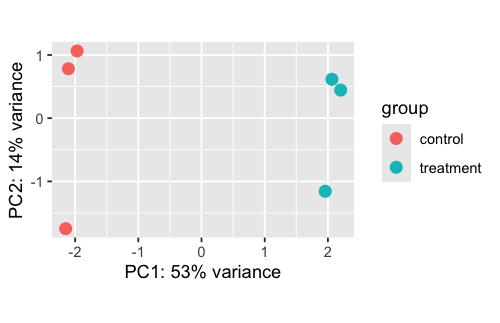
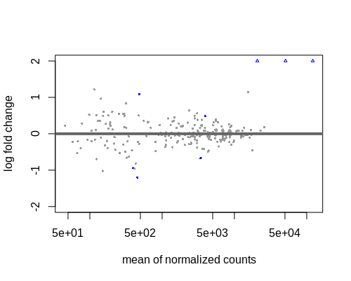

# Interpretation

Once DE genes have been identified, the next crucial step is to interpret the results. This involves the inspection of tables and plots generated during the analysis to understand the biological significance of the data. In this part of the tutorial, we will delve into the results by discussing the significant DE genes and we will explore various plots generated during the analysis.

!!! note

    The results illustrated in this section might show slight variations compared to your runs due to randomness in the STAR algorithm. This randomness arises from using variable seed values and parallel processing, leading to minor differences in results between runs on the same data. These small discrepancies are not biologically significant and may affect counts and subsequent plots (such as PCA and count plots). However, the overall patterns and main findings should remain consistent. While exact reproducibility is ideal, minor variations are acceptable in practice, as long as they do not impact the main conclusions of the study.

## Quality control plots

The first plot we will examine is the Principal Component Analysis (PCA) plot. Since we're working with simulated data, our metadata is relatively simple, consisting of just three variables: sample, condition and replica. In a typical RNA-seq experiment, however, metadata can be complex and encompass a wide range of variables that could contribute to sample variation, such as sex, age and developmental stage.



By plotting the PCA on the PC1 and PC2 axes, using `condition` as the main variable of interest, we can quickly identify the primary source of variation in our data. By accounting for this variation in our design model, we should be able to detect more differentially expressed genes related to `condition`. When working with real data, it's often useful to plot the data using different variables to explore how much variation is explained by the first two PCs. Depending on the results, it may be informative to examine variation on additional PC axes, such as PC3 and PC4, to gain a more comprehensive understanding of the data.

Next, we will examine the hierarchical clustering plot to explore the relationships between samples based on their gene expression profiles. The heatmap is organized such that samples with similar expression profiles are close to each other, allowing us to identify patterns in the data.


Remember that to create this plot, we utilized the `dist()` function, so in the legend on the right, a value of 0 corresponds to high correlation, while a value of 5 corresponds to very low correlation. Similar to PCA, we can see that samples tend to cluster together according to `condition`, indeed we can observe a high degree of correlation between the three control samples and between the three treated samples.

Overall, the integration of these plots suggests that we are working with high-quality data and we can confidently proceed to the differential expression analysis.

## Differential expression results

From this point, we will examine plots that are generated after the differential expression analysis. These plots are not quality control (QC) plots, but rather plots that help us to interpret the results.
After running the `results()` function, a good way to start to have an idea about the results is to look at the MA plot.



By default, genes are coloured in blue if the padj is less than 0.1 and the log2foldchange greater than or less than 0. Genes that fall outside the plotting region are represented as open triangles. Note that we have not yet applied a filter to select only significant, which we define as those with a padj value less than 0.5 and a log2 fold change of at least 1 or -1.

After filtering our genes of interest according to our threshold, let's have a look to our significatnt genes:

```bash
gene                baseMean        log2FoldChange     lfcSE          stat            pvalue              padj
ENSG00000205726     121645.5908     2.894480           0.1515387      19.100600       2.496005e-81        5.840651e-79
ENSG00000142192     51065.3192      3.025489           0.1891258      15.997230       1.335883e-57        1.562983e-55
ENSG00000142156     20805.8078      2.977705           0.2159277      13.790287       2.915972e-43        2.274458e-41
ENSG00000159231     458.9277        -1.194777          0.3058100      -3.906926       9.347790e-05        5.468457e-03
ENSG00000156282     481.7624        1.095272           0.2969594      3.688289        2.257672e-04        1.056590e-02
```

To gain a comprehensive overview of the transcriptional profile, the volcano plot represents a highly informative tool.


The treatment induced differential expression in five genes, with one downregulated and four upregulated. This plot visually represents the numerical results reported in the table above.

After the identification of DE genes, it's informative to visualise the expression of specific genes of interest. The `plotCounts()` function applied directly on the `dds` object allows us to examine individual gene expression profiles without accessing the full `res` object.


In our example, post-treatment, we observe a significant increase in the expression of the _ENSG00000142192_ gene, highlighting its responsiveness to the experimental conditions.

Finally, we can create a heatmap using the normalised expression counts of DE genes. The resulting heatmap visualises how the expression of significant genes varies across samples. Each row represents a gene, and each column represents a sample. The color intensity in the heatmap reflects the normalised expression levels: red colors indicate higher expression, while blue colors indicate lower expression.


By examining the heatmap, we can visually identify the expression patterns of our five significant differentially expressed genes. This visualization allows us to identify how these genes respond to the treatment. The heatmap provides a clear and intuitive way to explore gene expression dynamics.

## Over Representation Analysis (ORA)

Finally, we can attempt to assign biological significance to our differentially expressed genes through **Enrichment Analysis (ORA)**. The ORA analysis identifies specific biological pathways, molecular functions and cellular processes, according to the **Gene Ontology (GO)** database, that are enriched within our differentially expressed genes.


The enrichment analysis reveals a possible involvement of cellular structures and processes, including "clathrin-coated pit", "dendritic spine", "neuron spine" and "endoplasmic reticulum lumen". These terms suggest a focus on cellular transport, structural integrity and protein processing, especially in neural contexts. This pattern points to pathways related to cellular organization and maintenance, possibly playing an important role in the biological condition under study.

## Conclusions

In this tutorial, we have walked through the steps of performing differential expression analysis using DESeq2, from preparing the data to interpreting the results. We have seen how to identify differentially expressed genes, visualise the results and perform enrichment analysis to gain insights into the biological significance of the results. By following this tutorial, you should now be able to perform differential expression analysis using DESeq2 and interpret the results in the context of your own research question.
