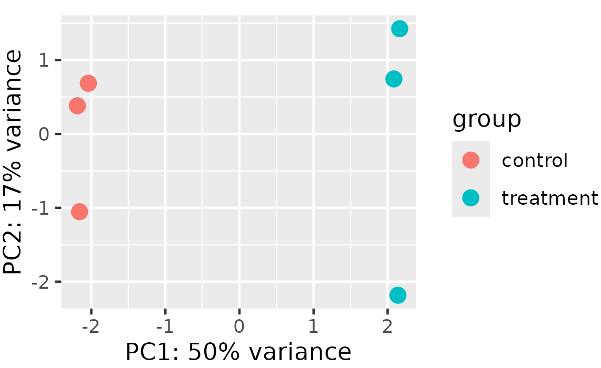
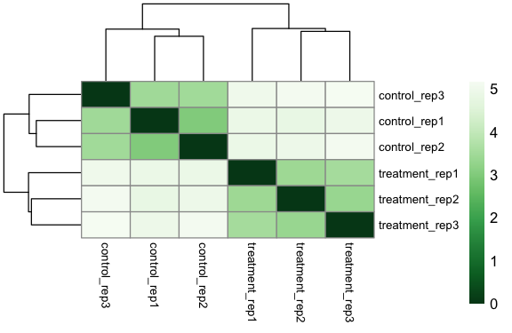
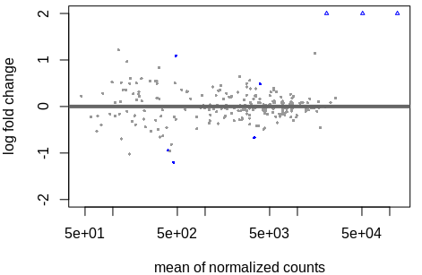
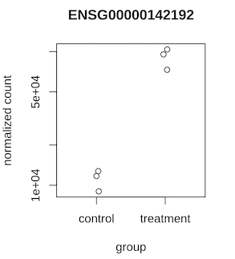
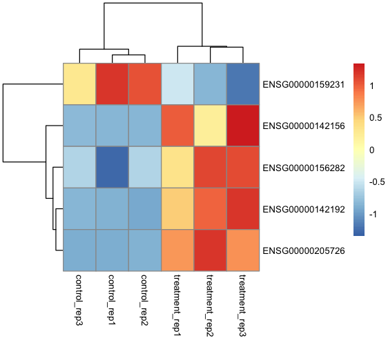
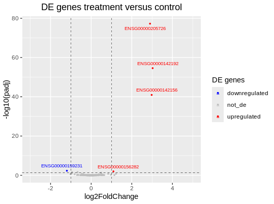
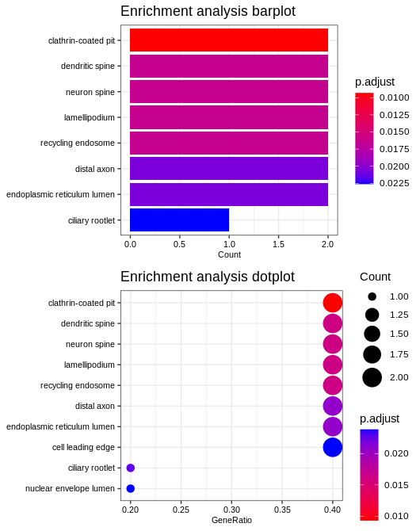

# Differential expression with DESeq2

This page walks through differential expression analysis using the DESeq2 object produced by nf-core/rnaseq. By the end, you will have identified differentially expressed genes, visualised the results, and run functional enrichment analysis.

## Load libraries

The analysis requires several R packages. Load them at the start of your script:

```r
#### Load libraries ####

library("tidyverse")
library("DESeq2")
library("pheatmap")
library("RColorBrewer")
library("ggrepel")
```

## Load the pipeline output

Load the pre-computed DESeq2 object (`dds`) generated by nf-core/rnaseq. If you used the default STAR + Salmon aligner:

```r
#### Import the dds from nf-core/rnaseq ####

load("results/star_salmon/deseq2_qc/deseq2.dds.RData")
```

If you used Salmon in pseudo-alignment mode, load the corresponding object from `results/salmon/deseq2_qc/deseq2.dds.RData` instead.

The `dds` object contains three key components:

- `countData`: a matrix of raw counts (genes × samples)
- `colData`: sample metadata (experimental conditions, replicates)
- `design`: the formula specifying the experimental model

Inspect them:

```r
#### Inspect the dds object ####

head(counts(dds))    # raw counts
colData(dds)         # sample metadata
design(dds)          # design formula
```

## Prepare metadata

The `colData` and `design` created by the pipeline need to be reorganised for your specific analysis. Create metadata from the information stored in the `dds`, rename columns, ensure row name ordering matches, and update the `colData`:

```r
#### Create metadata from dds colData ####

metadata <- DataFrame(
    sample = colData(dds)$sample,
    condition = colData(dds)$Group1,
    replica = colData(dds)$Group2
)

# Assign row names matching the count matrix columns
rownames(metadata) <- colnames(counts(dds))

# Update the dds colData with the new metadata
colData(dds) <- metadata
```

:::note
This operation also removes the `sizeFactors` already estimated by the pipeline. They will be re-estimated by DESeq2.
:::

Verify that sample names match between the `colData` and `countData`:

```r
#### Check sample name consistency ####

all(colnames(counts(dds)) %in% rownames(metadata))  # Must be TRUE
all(colnames(counts(dds)) == rownames(metadata))     # Must be TRUE
```

Create a new DESeq2 object with the corrected metadata and design:

```r
#### Create a new dds with corrected metadata ####

dds_new <- DESeqDataSet(dds, design = ~ condition)

head(counts(dds_new))    # raw counts
colData(dds_new)         # updated sample metadata
design(dds_new)          # updated design formula
```

## Pre-filter low-count genes

Remove genes with very low counts to improve computational efficiency and reduce noise. A common threshold is to keep genes with at least 10 counts in a minimum of 3 samples:

```r
#### Pre-filter ####

smallestGroupSize <- 3
keep <- rowSums(counts(dds_new) >= 10) >= smallestGroupSize
dds_filtered <- dds_new[keep,]
```

## Run the differential expression analysis

The `DESeq()` function is a wrapper that runs normalisation (`estimateSizeFactors`), dispersion estimation (`estimateDispersions`), and the statistical test (`nbinomWaldTest`) in sequence:

```r
#### Run DESeq2 ####

dds_final <- DESeq(dds_filtered)
```

These steps can also be run individually:

```r
#### Step-by-step alternative ####

dds_final <- estimateSizeFactors(dds_filtered)
dds_final <- estimateDispersions(dds_final)
dds_final <- nbinomWaldTest(dds_final)
```

## Quality control

QC analysis identifies potential issues and confirms that the data are suitable for DE analysis. Use transformed counts (variance-stabilised or regularised-log) for visualisation:

:::warning
These transformations are for visualisation only. DESeq2 requires raw counts for the statistical analysis.
:::

```r
#### Transform counts for visualisation ####

rld <- rlog(dds_final, blind = TRUE)
```

Setting `blind = TRUE` (default) re-estimates dispersion independently of the experimental design, which is appropriate for unbiased QC. Set `blind = FALSE` to use the fitted dispersion when differences are expected to be due to the experimental design.

### PCA plot

Principal Component Analysis reveals the primary sources of variation in the data. Samples within the same condition group should cluster together:

```r
#### PCA plot ####

pca_plot <- plotPCA(rld, intgroup = "condition")
ggsave("de_results/pca_plot.png", plot = pca_plot, width = 6, height = 5, dpi = 300)
```



In a well-designed experiment, the primary source of variation (PC1) corresponds to your experimental condition. When working with real data, plot using different metadata variables to explore what drives variation. It can also be informative to examine PC3 and PC4 for additional structure.

### Hierarchical clustering

Hierarchical clustering shows sample relationships based on expression profiles. Samples with similar profiles cluster together:

```r
#### Hierarchical clustering ####

sampleDists <- dist(t(assay(rld)))
sampleDistMatrix <- as.matrix(sampleDists)
rownames(sampleDistMatrix) <- paste(rld$condition, rld$replica, sep = "_")
colnames(sampleDistMatrix) <- paste(rld$condition, rld$replica, sep = "_")
colors <- colorRampPalette(rev(brewer.pal(9, "Greens")))(255)

clustering_plot <- pheatmap(sampleDistMatrix,
                            clustering_distance_rows = sampleDists,
                            clustering_distance_cols = sampleDists,
                            col = colors,
                            fontsize_col = 8,
                            fontsize_row = 8)
ggsave("de_results/clustering_plot.png", plot = clustering_plot, width = 6, height = 5, dpi = 300)
```



In the distance matrix, a value of 0 corresponds to high correlation. Samples within the same condition group should show high correlation (low distance). If the PCA and clustering both show clear separation by condition, the data are suitable for DE analysis.

## Inspect normalised counts

```r
#### Normalised counts ####

head(counts(dds_final, normalized = TRUE))
head(counts(dds_final))  # compare with raw counts

normalised_counts <- as_tibble(counts(dds_final, normalized = TRUE))
normalised_counts$gene <- rownames(counts(dds_final))
normalised_counts <- normalised_counts %>%
  relocate(gene, .before = 1)  # Move gene column to first position

write.csv(normalised_counts, file = "de_results/normalised_counts.csv")
```

## Extract results

The `results()` function extracts the DE analysis results, returning a table with:

- **baseMean**: average expression across all samples
- **log2FoldChange**: log2 fold change between conditions
- **lfcSE**: standard error of the log2 fold change
- **stat**: Wald test statistic
- **pvalue**: raw p-value
- **padj**: adjusted p-value (Benjamini-Hochberg correction)

```r
#### Extract results ####

res <- results(dds_final)
head(res)
summary(res)
resultsNames(dds_final)
```

:::tip
The order of contrast names determines the direction of the fold change. The first level is the condition of interest and the second is the reference. To set a specific contrast: `results(dds_final, contrast = c("condition", "treatment", "control"))`.
:::

Save the results:

```r
#### Save results ####

res_viz <- res
res_viz$gene <- rownames(res)
res_viz <- as_tibble(res_viz) %>%
  relocate(gene, .before = baseMean)

write.csv(res_viz, file = "de_results/de_result_table.csv")
```

### Filter significant genes

Apply thresholds to identify significantly differentially expressed genes. Here we use padj < 0.05 and |log2FoldChange| > 1:

```r
#### Filter significant DE genes ####

resSig <- subset(res_viz, padj < 0.05 & abs(log2FoldChange) > 1)
resSig <- as_tibble(resSig) %>%
  relocate(gene, .before = baseMean)
resSig <- resSig[order(resSig$padj),]
resSig

write.csv(resSig, file = "de_results/sig_de_genes.csv")
```

## Visualise results

### MA plot

The MA plot shows the relationship between mean expression (x-axis) and log2 fold change (y-axis). Genes coloured in blue have padj < 0.1. Genes outside the plotting region appear as open triangles:

```r
#### MA plot ####

png("de_results/MA_plot.png", width = 1500, height = 1000, res = 300)
plotMA(res, ylim = c(-2, 2))
dev.off()
```



### Counts plot

Plot normalised counts for a specific gene of interest to compare expression across conditions:

```r
#### Count plot for a specific gene ####

png("de_results/plotCounts.png", width = 1000, height = 1200, res = 300)
plotCounts(dds_final, gene = "ENSG00000142192")
dev.off()
```



### Heatmap

Visualise normalised counts for all significant genes to identify expression patterns across samples:

```r
#### Heatmap of significant genes ####

significant_genes <- resSig[, 1]
significant_counts <- inner_join(normalised_counts, significant_genes, by = "gene") %>%
  column_to_rownames("gene")

heatmap <- pheatmap(significant_counts,
                    cluster_rows = TRUE,
                    fontsize = 8,
                    scale = "row",
                    fontsize_row = 8,
                    height = 10)
ggsave("de_results/heatmap.png", plot = heatmap, width = 6, height = 5, dpi = 300)
```



Each row represents a gene and each column a sample. Red indicates higher expression, blue indicates lower expression (row-scaled). The clustering groups genes and samples with similar expression patterns.

### Volcano plot

The volcano plot displays log2 fold change (x-axis) against -log10 adjusted p-value (y-axis), highlighting both the magnitude and significance of expression changes:

```r
#### Volcano plot ####

res_tb <- as_tibble(res) %>%
  mutate(diffexpressed = case_when(
    log2FoldChange > 1 & padj < 0.05 ~ 'upregulated',
    log2FoldChange < -1 & padj < 0.05 ~ 'downregulated',
    TRUE ~ 'not_de'))

res_tb$gene <- rownames(res)
res_tb <- res_tb %>%
  relocate(gene, .before = baseMean)

res_tb <- res_tb %>% arrange(padj) %>%
  mutate(genelabels = "")
res_tb$genelabels[1:5] <- res_tb$gene[1:5]

volcano_plot <- ggplot(data = res_tb, aes(x = log2FoldChange, y = -log10(padj), col = diffexpressed)) +
  geom_point(size = 0.6) +
  geom_text_repel(aes(label = genelabels), size = 2.5, max.overlaps = Inf) +
  ggtitle("DE genes treatment versus control") +
  geom_vline(xintercept = c(-1, 1), col = "black", linetype = 'dashed', linewidth = 0.2) +
  geom_hline(yintercept = -log10(0.05), col = "black", linetype = 'dashed', linewidth = 0.2) +
  theme(plot.title = element_text(size = rel(1.25), hjust = 0.5),
        axis.title = element_text(size = rel(1))) +
  scale_color_manual(values = c("upregulated" = "red",
                                "downregulated" = "blue",
                                "not_de" = "grey")) +
  labs(color = 'DE genes') +
  xlim(-3, 5)

ggsave("de_results/volcano_plot.png", plot = volcano_plot, width = 6, height = 5, dpi = 300)
```



Genes in the upper left (downregulated) and upper right (upregulated) corners are both significant and show large expression changes.

## Functional enrichment analysis

To assign biological meaning to the list of DE genes, run Over-Representation Analysis (ORA) using clusterProfiler. ORA uses the hypergeometric test to identify biological pathways or Gene Ontology terms that are enriched in the DE gene list compared to the background (all tested genes):

```r
#### Enrichment analysis (ORA) ####

library(clusterProfiler)
library(org.Hs.eg.db)

# Prepare gene list
gene_list <- res$log2FoldChange
names(gene_list) <- rownames(res)
gene_list <- sort(gene_list, decreasing = TRUE)

# Extract significant genes
res_genes <- rownames(resSig)

# Run GO enrichment
go_enrich <- enrichGO(
  gene = res_genes,
  universe = names(gene_list),
  OrgDb = org.Hs.eg.db,
  keyType = 'ENSEMBL',
  readable = TRUE,
  ont = "ALL",
  pvalueCutoff = 0.05,
  qvalueCutoff = 0.10
)

# Visualise
barplot <- barplot(go_enrich, title = "Enrichment analysis barplot", font.size = 8)
dotplot <- dotplot(go_enrich, title = "Enrichment analysis dotplot", font.size = 8)

library(cowplot)
go_plot <- plot_grid(barplot, dotplot, ncol = 2)
ggsave("de_results/go_plot.png", plot = go_plot, width = 13, height = 6, dpi = 300)
```



The enrichment results identify biological pathways, molecular functions, and cellular processes that are over-represented among the DE genes.

:::note
Results from this tutorial use simulated data and will show slight variations between runs due to randomness in the STAR algorithm. The overall patterns and main findings remain consistent.
:::
