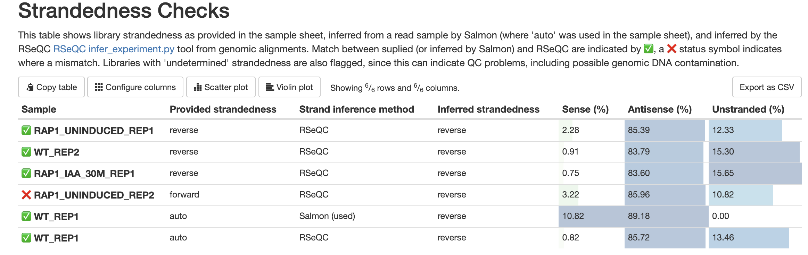

# Samplesheet input

You will need to create a samplesheet with information about the samples you would like to analyse before running the pipeline. Use the `--input` parameter to specify its location. It has to be a comma-separated file with the 4 required columns: `sample`, `fastq_1`, `fastq_2`, and `strandedness`.

```bash
--input '[path to samplesheet file]'
```

A basic samplesheet for paired-end data looks like:

```csv title="samplesheet.csv"
sample,fastq_1,fastq_2,strandedness
CONTROL_REP1,AEG588A1_S1_L002_R1_001.fastq.gz,AEG588A1_S1_L002_R2_001.fastq.gz,auto
CONTROL_REP2,AEG588A2_S2_L002_R1_001.fastq.gz,AEG588A2_S2_L002_R2_001.fastq.gz,auto
CONTROL_REP3,AEG588A3_S3_L002_R1_001.fastq.gz,AEG588A3_S3_L002_R2_001.fastq.gz,auto
```

For single-end data, leave the `fastq_2` column empty:

```csv title="samplesheet.csv"
sample,fastq_1,fastq_2,strandedness
TREATMENT_REP1,AEG588A4_S4_L003_R1_001.fastq.gz,,auto
TREATMENT_REP2,AEG588A5_S5_L003_R1_001.fastq.gz,,auto
TREATMENT_REP3,AEG588A6_S6_L003_R1_001.fastq.gz,,auto
```

If samples were sequenced on different platforms or at different centers, you can specify per-sample values via optional `seq_platform` and `seq_center` columns (used in BAM read group tags). For uniform values across all samples, the `--seq_platform` and `--seq_center` parameters are simpler.

The pipeline will auto-detect whether a sample is single- or paired-end using the information provided in the samplesheet. The samplesheet can have as many columns as you desire, however, there is a strict requirement for the first 4 columns to match those defined in the table below.

An [example samplesheet](../../assets/samplesheet.csv) has been provided with the pipeline.

## Full samplesheet

A samplesheet consisting of both single- and paired-end data may look something like the one below. This is for 6 samples, where `TREATMENT_REP3` has been sequenced twice.

```csv title="samplesheet.csv"
sample,fastq_1,fastq_2,strandedness,seq_platform
CONTROL_REP1,AEG588A1_S1_L002_R1_001.fastq.gz,AEG588A1_S1_L002_R2_001.fastq.gz,forward,ILLUMINA
CONTROL_REP2,AEG588A2_S2_L002_R1_001.fastq.gz,AEG588A2_S2_L002_R2_001.fastq.gz,forward,ILLUMINA
CONTROL_REP3,AEG588A3_S3_L002_R1_001.fastq.gz,AEG588A3_S3_L002_R2_001.fastq.gz,forward,ILLUMINA
TREATMENT_REP1,AEG588A4_S4_L003_R1_001.fastq.gz,,reverse,ILLUMINA
TREATMENT_REP2,AEG588A5_S5_L003_R1_001.fastq.gz,,reverse,ILLUMINA
TREATMENT_REP3,AEG588A6_S6_L003_R1_001.fastq.gz,,reverse,ILLUMINA
TREATMENT_REP3,AEG588A6_S6_L004_R1_001.fastq.gz,,reverse,ILLUMINA
```

### Column descriptions

| Column              | Description                                                                                                                                                                                                                                                                         |
| ------------------- | ----------------------------------------------------------------------------------------------------------------------------------------------------------------------------------------------------------------------------------------------------------------------------------- |
| `sample`            | Custom sample name. This entry will be identical for multiple sequencing libraries/runs from the same sample. Spaces in sample names are automatically converted to underscores (`_`).                                                                                              |
| `fastq_1`           | Full path to FastQ file for Illumina short reads 1. File has to be gzipped and have the extension ".fastq.gz" or ".fq.gz".                                                                                                                                                          |
| `fastq_2`           | Full path to FastQ file for Illumina short reads 2. File has to be gzipped and have the extension ".fastq.gz" or ".fq.gz".                                                                                                                                                          |
| `strandedness`      | Sample strand-specificity. Must be one of `unstranded`, `forward`, `reverse` or `auto`.                                                                                                                                                                                             |
| `seq_platform`      | **Optional**. Sequencing platform for BAM read group `PL` tag (such as `ILLUMINA`). Use this column when samples were sequenced on different platforms. For a single platform across all samples, prefer `--seq_platform` instead. Per-sample values override the global parameter. |
| `seq_center`        | **Optional**. Sequencing center for BAM read group `CN` tag. Use this column when samples come from different centers. For a single center across all samples, prefer `--seq_center` instead. Per-sample values override the global parameter.                                      |
| `genome_bam`        | **Optional**. Full path to genome-aligned BAM file. Typically from previous pipeline runs (see [output documentation](../output.md)). Used for [BAM reprocessing](#bam-input-for-reprocessing-workflow).                                                                            |
| `transcriptome_bam` | **Optional**. Full path to transcriptome-aligned BAM file. Typically from previous pipeline runs (see [output documentation](../output.md)). Used for [BAM reprocessing](#bam-input-for-reprocessing-workflow).                                                                     |
| `percent_mapped`    | **Optional**. Percentage of reads that mapped during alignment (0-100). Useful for quality assessment and filtering.                                                                                                                                                                |

> **NB:** The `group` and `replicate` columns were replaced with a single `sample` column as of v3.1 of the pipeline. The `sample` column is essentially a concatenation of the `group` and `replicate` columns, however it now also offers more flexibility when replicate information is not required, for example when sequencing clinical samples. If all values of `sample` have the same number of underscores, fields defined by these underscore-separated names may be used in the PCA plots produced by the pipeline, to regain the ability to represent different groupings.

## Multiple runs of the same sample

The `sample` identifiers have to be the same when you have re-sequenced the same sample more than once, for example to increase sequencing depth. The pipeline will concatenate the raw reads before performing any downstream analysis. Below is an example for the same sample sequenced across 3 lanes.

```csv title="samplesheet.csv"
sample,fastq_1,fastq_2,strandedness,seq_platform
CONTROL_REP1,AEG588A1_S1_L002_R1_001.fastq.gz,AEG588A1_S1_L002_R2_001.fastq.gz,auto,ILLUMINA
CONTROL_REP1,AEG588A1_S1_L003_R1_001.fastq.gz,AEG588A1_S1_L003_R2_001.fastq.gz,auto,ILLUMINA
CONTROL_REP1,AEG588A1_S1_L004_R1_001.fastq.gz,AEG588A1_S1_L004_R2_001.fastq.gz,auto,ILLUMINA
```

## Strandedness prediction

If you set the strandedness value to `auto`, the pipeline will sub-sample the input FastQ files to 1 million reads, use Salmon Quant to automatically infer the strandedness, and then propagate this information through the rest of the pipeline. This behaviour is controlled by the `--stranded_threshold` and `--unstranded_threshold` parameters, which are set to 0.8 and 0.1 by default, respectively. This means:

- **Forward stranded:** At least 80% of the fragments are in the 'forward' orientation.
- **Unstranded:** The forward and reverse fractions differ by less than 10%.
- **Undetermined:** Samples that do not meet either criterion, possibly indicating issues such as genomic DNA contamination.

:::note
These thresholds apply to both the strandedness inferred from Salmon outputs for input to the pipeline and how strandedness is inferred from RSeQC results using pipeline outputs.
:::

### Usage examples

1. **Forward Stranded Sample:**
   - Forward fraction: 0.85
   - Reverse fraction: 0.15
   - **Classification:** Forward stranded

2. **Reverse Stranded Sample:**
   - Forward fraction: 0.1
   - Reverse fraction: 0.9
   - **Classification:** Reverse stranded

3. **Unstranded Sample:**
   - Forward fraction: 0.45
   - Reverse fraction: 0.55
   - **Classification:** Unstranded

4. **Undetermined Sample:**
   - Forward fraction: 0.6
   - Reverse fraction: 0.4
   - **Classification:** Undetermined

You can control the stringency of this behaviour with `--stranded_threshold` and `--unstranded_threshold`.

### Errors and reporting

The results of strandedness inference are displayed in the MultiQC report under 'Strandedness Checks'. This shows any provided strandedness and the results inferred by both Salmon (when strandedness is set to 'auto') and RSeQC. Mismatches between input strandedness (explicitly provided by the user or inferred by Salmon) and output strandedness from RSeQC are marked as fails. For example, if a user specifies 'forward' as strandedness for a library that is actually reverse stranded, this is marked as a fail.



Be sure to check the strandedness report when reviewing the QC for your samples.

## Linting

By default, the pipeline will run [fq lint](https://github.com/stjude-rust-labs/fq) on all input FASTQ files, both at the start of preprocessing and after each preprocessing step that manipulates FASTQ files. If errors are found, an error will be reported and the workflow will stop.

The `extra_fqlint_args` parameter can be manipulated to disable [any validator](https://github.com/stjude-rust-labs/fq?tab=readme-ov-file#validators) from `fq` you wish. For example, we have found that checks on the names of paired reads are prone to failure, so that check is disabled by default (setting `extra_fqlint_args` to `--disable-validator P001`).

## BAM input for reprocessing workflow

The pipeline supports a **two-step workflow** for efficient reprocessing without expensive alignment steps. This feature is designed specifically for re-running with BAM files generated by previous runs of this same pipeline.

### Step 1: Initial run with BAM generation

Run the pipeline normally, adding `--save_align_intermeds` to publish BAM files and generate a reusable samplesheet:

```bash
nextflow run nf-core/rnaseq \
  --input samplesheet.csv \
  --save_align_intermeds \
  --outdir results_initial \
  -profile docker
```

This creates `samplesheets/samplesheet_with_bams.csv` containing paths to the generated BAM files.

### Step 2: Reprocessing run with BAM input

Use the auto-generated samplesheet to reprocess data, skipping alignment:

```bash
nextflow run nf-core/rnaseq \
  --input samplesheets/samplesheet_with_bams.csv \
  --skip_alignment \
  --outdir results_reprocessed \
  -profile docker
```

The `--skip_alignment` flag tells the pipeline to skip alignment, and in this situation it will use any provided BAM files instead of performing alignment, putting them through post-processing and quantification only.

### Example of generated samplesheet

The `samplesheet_with_bams.csv` will look like:

```csv
sample,fastq_1,fastq_2,strandedness,seq_platform,seq_center,genome_bam,percent_mapped,transcriptome_bam
SAMPLE1,/path/sample1_R1.fastq.gz,/path/sample1_R2.fastq.gz,forward,ILLUMINA,,results/star_salmon/SAMPLE1.markdup.sorted.bam,85.2,results/star_salmon/SAMPLE1.Aligned.toTranscriptome.out.bam
SAMPLE2,/path/sample2_R1.fastq.gz,,reverse,ILLUMINA,,results/star_salmon/SAMPLE2.sorted.bam,92.1,results/star_salmon/SAMPLE2.Aligned.toTranscriptome.out.bam
```

### Important limitations

:::warning
This feature is designed specifically for BAM files generated by this pipeline. Using arbitrary BAM files from other sources is **not officially supported** and will likely only work via the two-step workflow described above. Users attempting to use other BAMs do so at their own risk.
:::

:::warning
You cannot mix quantifier types between BAM generation and reprocessing runs. BAM files generated with `--aligner star_salmon` must be reprocessed with `--aligner star_salmon`. Similarly, BAM files from `--aligner star_rsem` must be reprocessed with `--aligner star_rsem`. Mixing quantifier types will likely produce incorrect results due to incompatible alignment parameters.
:::

**Key technical details:**

- BAM files are only used when `--skip_alignment` is specified
- The pipeline automatically indexes provided BAM files
- You can provide just `genome_bam`, just `transcriptome_bam`, or both
- Mixed samplesheets are supported, but samples with BAM files require `--skip_alignment`
- Without `--skip_alignment`, the pipeline will perform alignment even if BAM files are provided
- For BAM file locations from pipeline outputs, see the [output documentation](../output.md)

This workflow is ideal for tweaking downstream processing steps (quantification methods, QC parameters, differential expression analysis) without repeating time-consuming alignment.
